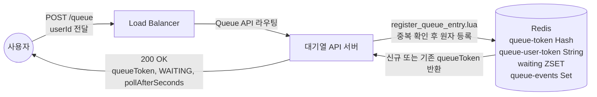
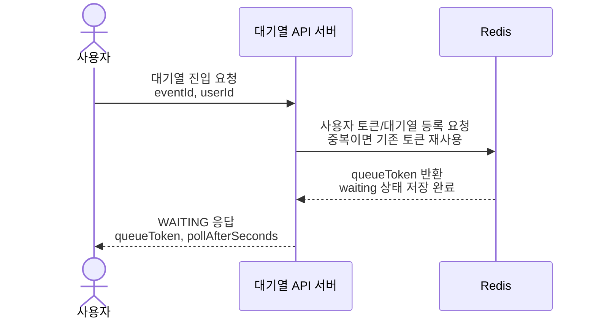

# Flow 1 — 사용자가 대기열에 등록되는 과정

## 개요

사용자가 티켓팅 페이지에 접속하면 클라이언트가 POST 요청 하나를 보내 대기열에 진입합니다. 시스템은 Redis에서 원자적으로 사용자를 등록하고 폴링 토큰을 즉시 반환합니다. 이 경로에서는 데이터베이스 쓰기가 발생하지 않습니다.

**SLA 목표**: 순수 Redis 경로이므로 P99 < 10 ms.

---

## 상호작용 요약



---

## 시퀀스 다이어그램



---

## 주요 설계 결정

### 1. Lua 스크립트로 원자성 확보

토큰 Hash, 역색인, waiting ZSET, 이벤트 레지스트리, TTL 설정까지 다섯 가지 Redis 쓰기가 하나의 원자 단위로 실행됩니다.

Lua 없이 구현하면 `GET`과 `ZADD` 사이에 경쟁 조건이 생깁니다. 동시에 들어온 중복 요청이 두 번 모두 `GET`에서 빈 값을 보고, 둘 다 `ZADD`를 실행하여 같은 사용자가 대기열에 두 번 등록될 수 있습니다. Lua 실행은 Redis가 단일 명령처럼 처리하므로 이 문제가 원천적으로 발생하지 않습니다.

### 2. Score = 타임스탬프 + 소수점 시퀀스

```
score = epochMilli + (인스턴스별 단조증가 시퀀스 / 1_000_000)
```

초당 수천 명이 동시 진입하면 같은 밀리초 안에 Score 충돌이 발생합니다. ZSET은 Score가 동일하면 member(userId) 사전순으로 정렬하므로, UUID 기반 userId를 쓰면 도착 순서가 사실상 랜덤해집니다. 소수점 이하에 단조증가 시퀀스를 더해 밀리초 내 도착 순서도 안정적으로 유지합니다.

`ZADD NX` 플래그는 재시도나 Lua 중복 분기에서도 기존 Score를 절대 덮어쓰지 않도록 합니다.

### 3. 멱등적 진입

동일 사용자가 이 엔드포인트를 두 번 호출해도(더블 클릭, 네트워크 재시도 등) Lua 스크립트가 역색인 키를 감지하고 기존 토큰을 반환합니다. 대기 위치는 항상 하나입니다.

### 4. 데이터베이스 미접촉

전체 흐름에서 MySQL을 전혀 건드리지 않습니다. 30,000건의 동시 대기열 등록이 데이터베이스 부하 없이 처리되는 이유입니다.

---

## 진입 후 Redis 상태

```
waiting:{eventId}                    ZSET    { "user-42": 1747036800000.000042 }
queue-token:{uuid}                   HASH    { eventId: "...", userId: "user-42", createdAt: "..." }
queue-user-token:{eventId}:user-42   STRING  "{uuid}"  TTL=3600s
queue-events                         SET     { "{eventId}" }
queue-metrics:registered             STRING  "1"
```

---

## 오류 케이스

| 조건 | HTTP 상태 | 에러 코드 |
|---|---|---|
| `eventId` 값 없음 | 400 | `BAD_REQUEST` |
| `userId` 값 없음 | 400 | `BAD_REQUEST` |
| Redis 연결 불가 | 500 | `INTERNAL_ERROR` |

---

## 기술적 하이라이트

### 왜 Lua인가 — TOCTOU 경쟁 조건을 원천 차단

관련 구현: [register_queue_entry.lua](src/main/resources/lua/register_queue_entry.lua), [RedisQueueRepository.java](src/main/java/com/example/ticketing/queue/infrastructure/RedisQueueRepository.java)

중복 진입 방지를 Java 레벨에서 구현하면 다음 경쟁 조건이 발생합니다.

```
스레드 A: GET queue-user-token → null
스레드 B: GET queue-user-token → null    ← A가 쓰기 전에 도착
스레드 A: ZADD waiting → 등록 성공
스레드 B: ZADD waiting → 동일 userId 이중 등록
```

Redis의 `EVAL` 명령은 서버 사이드에서 단일 명령처럼 실행되어 두 스레드가 동시에 진입해도 하나만 신규 등록됩니다. MULTI/EXEC(트랜잭션)이 아닌 Lua를 선택한 이유는, 트랜잭션은 조건 분기(if-else)가 불가능해 "이미 존재하면 기존 토큰 반환" 로직을 표현할 수 없기 때문입니다.

### Score 설계 — 공정한 선착순을 위한 서브밀리초 정렬

관련 구현: [QueueEntryService.java](src/main/java/com/example/ticketing/queue/application/QueueEntryService.java)

```
score = System.currentTimeMillis() + (atomicSequence.getAndIncrement() / 1_000_000.0)
```

초당 수천 명이 동시에 진입하면 같은 밀리초 안에 score가 충돌합니다. Redis ZSET은 score가 같을 때 member(userId) 사전순으로 정렬하므로, UUID 기반 userId를 쓰면 도착 순서가 랜덤해집니다. 인스턴스별 단조증가 시퀀스를 소수점 이하에 더해 밀리초 내 도착 순서도 안정적으로 보존합니다. `ZADD NX` 플래그는 재시도가 들어와도 기존 score를 덮어쓰지 않도록 보호합니다.

### `KEYS *` 대신 레지스트리 Set — 프로덕션 안전성

관련 구현: [register_queue_entry.lua](src/main/resources/lua/register_queue_entry.lua), [AdmissionSchedulerService.java](src/main/java/com/example/ticketing/queue/application/AdmissionSchedulerService.java)

대기열이 있는 이벤트 목록을 얻는 가장 쉬운 방법은 `KEYS waiting:*`입니다. 그러나 이 명령은 Redis 전체 키스페이스를 순회하는 O(N) 블로킹 연산으로, 키 수십만 개인 환경에서 수백 ms 지연을 유발합니다. `queue-events` SET에 이벤트 ID를 등록하고 `SMEMBERS`로 조회하면 O(1)이며 메인 스레드를 블로킹하지 않습니다.

### DB-Free 핫 패스 — 가장 폭발적인 구간에서 데이터베이스 보호

관련 구현: [QueueEntryService.java](src/main/java/com/example/ticketing/queue/application/QueueEntryService.java), [RedisQueueRepository.java](src/main/java/com/example/ticketing/queue/infrastructure/RedisQueueRepository.java)

대기열 진입은 30,000명이 동시에 누르는 "개장" 순간에 가장 많은 요청이 몰립니다. 이 경로에서 MySQL을 단 한 번도 건드리지 않기 때문에 DB 커넥션 풀 소진이나 락 경합이 발생하지 않습니다. Redis 단일 인스턴스 기준 초당 수십만 건을 P99 한 자릿수 ms로 처리할 수 있는 구조입니다.
