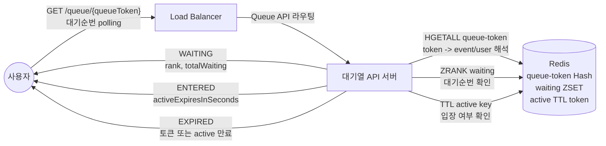
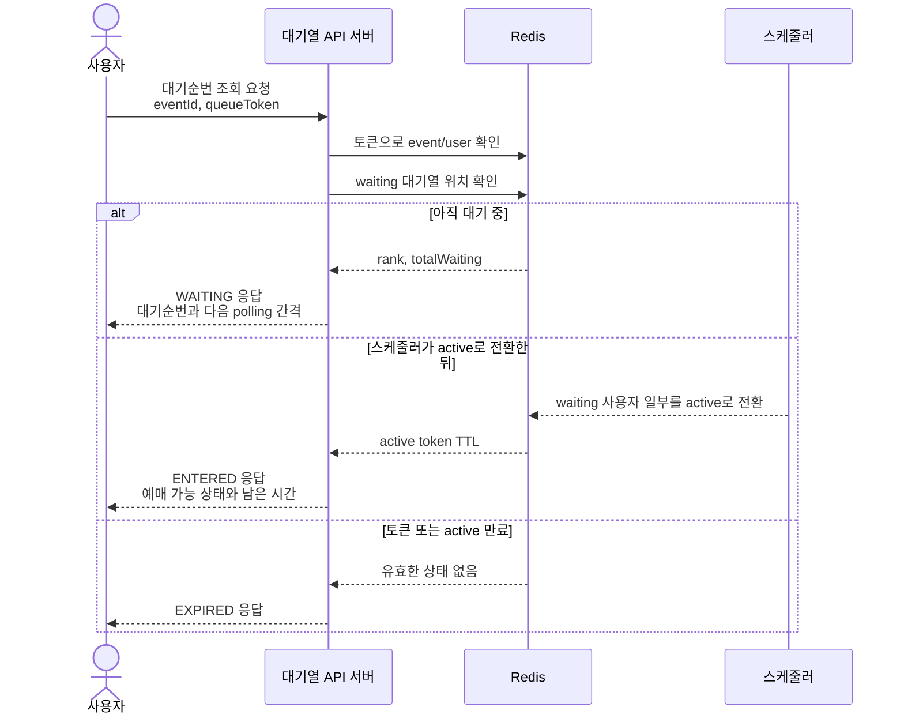

# Flow 2 — 사용자가 토큰으로 자신의 순번을 확인하는 과정

## 개요

대기열에 진입한 후, 클라이언트는 Flow 1에서 받은 토큰으로 N초마다(기본값 5초) 대기 상태를 폴링합니다. 시스템은 토큰을 `(eventId, userId)` 쌍으로 해석한 뒤, `WAITING`, `ENTERED`, `EXPIRED` 세 가지 상태 중 하나를 반환합니다.

이 경로는 읽기 전용입니다. 만료 카운터 증가(INCR) 외에 Redis 쓰기가 발생하지 않습니다.

---

## 상호작용 요약



---

## 시퀀스 다이어그램



---

## 상태 전이도

```
           ┌──────────────────────────────────────────────────┐
           │                    WAITING                       │
           │  • waiting:{eventId} ZSET에 존재                 │
           │  • rank + totalWaiting 반환                      │
           └─────────────────┬────────────────────────────────┘
                             │ 스케줄러가 사용자를 입장 허가
                             ▼
           ┌──────────────────────────────────────────────────┐
           │                    ENTERED                       │
           │  • waiting ZSET에 없음                           │
           │  • active:{eventId}:{userId} 존재 (TTL > 0)      │
           │  • activeExpiresInSeconds 반환                   │
           └─────────────────┬────────────────────────────────┘
                             │ active TTL 만료 또는
                             │ 토큰 Hash TTL 만료
                             ▼
           ┌──────────────────────────────────────────────────┐
           │                    EXPIRED                       │
           │  • queue-token Hash 없음, 또는                   │
           │  • waiting ZSET에 없고 active 키도 없음          │
           └──────────────────────────────────────────────────┘
```

---

## 주요 설계 결정

### 1. 토큰 기반 해석 (서버 세션 불필요)

서버가 "누가 폴링 중인가"를 별도의 세션 상태로 저장하지 않습니다. 클라이언트의 토큰이 유일한 식별자입니다. `HGETALL`로 토큰 → `(eventId, userId)` 변환이 O(1) Redis 읽기 한 번으로 완료됩니다.

### 2. eventId 교차 검증

토큰을 해석한 뒤, 토큰에 저장된 `eventId`가 경로 파라미터의 `eventId`와 일치하는지 확인합니다. UUID 토큰을 추측해 다른 이벤트의 대기열을 조회하는 시도를 차단합니다.

### 3. 우선순위 기반 상태 판별 (경쟁 조건 없음)

상태 확인은 엄격한 우선순위 순서를 따릅니다.

1. 토큰 Hash 존재 여부 (폴링 토큰 TTL)
2. waiting ZSET 멤버십 (ZRANK)
3. active 키 TTL (입장 허가 여부)

입장 허가 Lua 스크립트(`admit_waiting_users.lua`)가 waiting ZSET에서 제거(ZREM)와 active 키 설정(SET)을 원자적으로 수행하므로, 정상 입장 처리 중 사용자가 ZSET에도 없고 active 키도 없는 순간이 존재하지 않습니다.

### 4. 만료 메트릭 카운터

`INCR queue-metrics:expired-lookup`은 두 경로에서 발생합니다. 토큰 Hash가 없는 경우, 그리고 ZSET에도 없고 active 키도 없는 경우입니다. 이 카운터로 운영자가 토큰 만료 후의 idle 폴링과 실제 트래픽을 구분할 수 있습니다.

---

## 오류 케이스

| 조건 | HTTP 상태 | 에러 코드 |
|---|---|---|
| `eventId` 값 없음 | 400 | `BAD_REQUEST` |
| `queueToken`이 UUID 형식이 아님 | 400 | `BAD_REQUEST` |
| 토큰이 다른 `eventId` 소속 | 400 | `BAD_REQUEST` |
| Redis 연결 불가 | 500 | `INTERNAL_ERROR` |

---

## 기술적 하이라이트

### Stateless 폴링 — 서버가 "누가 기다리는가"를 기억하지 않는다

관련 구현: [QueueStatusService.java](src/main/java/com/example/ticketing/queue/application/QueueStatusService.java), [RedisQueueRepository.java](src/main/java/com/example/ticketing/queue/infrastructure/RedisQueueRepository.java)

전통적인 롱폴링 구현은 서버 메모리나 세션 저장소에 "대기 중인 클라이언트 목록"을 유지합니다. 이 설계는 그 상태를 완전히 없앴습니다. 클라이언트가 가져온 UUID 토큰이 Redis Hash 키 그 자체이고, `HGETALL`로 O(1)에 `(eventId, userId)` 쌍을 복원합니다. 서버 인스턴스가 몇 개든, 어느 인스턴스에 요청이 와도 동일한 응답이 나옵니다.

### eventId 교차 검증 — 토큰 스코프 탈취 차단

관련 구현: [QueueStatusService.java](src/main/java/com/example/ticketing/queue/application/QueueStatusService.java)

UUID는 예측 불가능하지만, 탈취한 토큰을 다른 이벤트의 엔드포인트에 제출하는 공격 시도를 차단합니다. 토큰 Hash에 저장된 `eventId`와 URL 경로 파라미터의 `eventId`를 서비스 레이어에서 대조해 일치하지 않으면 즉시 400을 반환합니다. DB 없이 Redis 한 번의 읽기로 인증 수준의 검증을 완료합니다.

### 우선순위 기반 상태 판별 — 동시성 창 없는 상태 전이

관련 구현: [QueueStatusService.java](src/main/java/com/example/ticketing/queue/application/QueueStatusService.java), [admit_waiting_users.lua](src/main/resources/lua/admit_waiting_users.lua)

상태 판별 순서(토큰 Hash → ZRANK → active TTL)는 임의적이지 않습니다. Flow 3의 입장 허가 Lua 스크립트가 `ZREM`과 `SET active... PX` 를 원자적으로 실행하기 때문에, 정상 처리 중에는 "ZSET에도 없고 active 키도 없는" 순간이 존재하지 않습니다. 이 순서를 지킴으로써 별도의 락 없이도 상태 판별이 항상 일관됩니다.

### 폴링 트래픽 설계 — 대기 인원 × 폴링 주기가 서버 부하를 결정한다

관련 구현: [QueueProperties.java](src/main/java/com/example/ticketing/queue/application/QueueProperties.java), [QueueStatusService.java](src/main/java/com/example/ticketing/queue/application/QueueStatusService.java)

대기 인원 10,000명이 5초마다 폴링하면 초당 2,000 RPS가 이 엔드포인트로 유입됩니다. 이 경로를 Redis 읽기 전용(HGETALL + ZRANK + ZCARD, 최대 3번)으로 유지한 것은 이 부하를 MySQL로 전달하지 않기 위한 의도적인 선택입니다. `pollAfterSeconds` 힌트를 응답에 포함해 클라이언트가 서버 부하에 따라 폴링 간격을 조정할 수 있는 여지를 남겼습니다.
