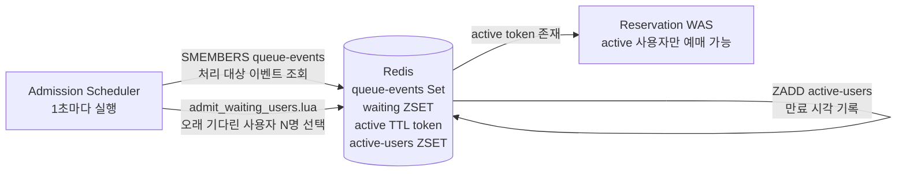
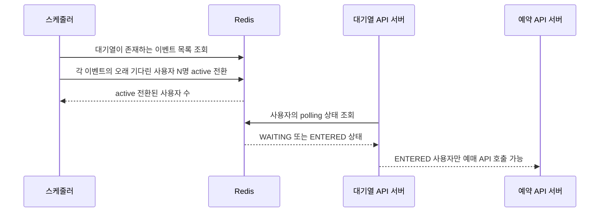

# Flow 3 — 스케줄러가 사용자를 대기열에서 Active로 변경하는 과정

## 개요

1,000ms마다 실행되는 스케줄러가 **트래픽 밸브** 역할을 합니다. waiting 대기열에서 가장 오래 기다린 N명을 꺼내 active 상태로 전환하고, 이 사용자들만 좌석 예매를 시도할 수 있게 됩니다. 기본 허가 속도는 초당 300명으로, 예매 API가 과부하에 걸리지 않도록 트래픽을 제어합니다.

이 플로우는 HTTP 경계가 없는 순수 내부 서버 프로세스입니다.

---

## 상호작용 요약



---

## 실행 흐름 다이어그램



---

## 주요 설계 결정

### 1. ZREM을 멱등성 가드로 활용

Lua 스크립트는 `ZRANGE`로 먼저 읽고(비파괴적), 이후 각 userId를 `ZREM`으로 제거합니다. `ZREM`의 반환값이 1(실제로 제거됨)인 경우에만 active 전환을 수행합니다.

`fixedRate`를 사용하므로 이전 틱이 1,000ms를 넘기면 다음 틱이 겹쳐 실행될 수 있습니다. 이 경우 두 번째 틱의 `ZREM`이 이미 제거된 userId에 대해 0을 반환하므로, 동일 사용자가 중복으로 active 전환되는 일이 발생하지 않습니다.

### 2. KEYS 스캔 대신 레지스트리 Set 사용

`SMEMBERS queue-events`로 대기열이 있는 이벤트만 순회합니다. 대안인 `KEYS waiting:*`은 Redis 키스페이스 전체에 대한 O(N) 블로킹 연산으로, 프로덕션 환경에서는 절대 사용해서는 안 됩니다. Set 레지스트리는 사용자가 대기열에 진입할 때 `SADD`로 자동으로 갱신됩니다.

### 3. TTL 키로 active 창 구현

```
SET active:{eventId}:{userId} {enteredAt} PX 60000
```

사용자가 입장 허가를 받고도 60초 내에 예매를 시도하지 않으면 키가 자동으로 사라집니다. 별도 만료 처리 로직이 필요 없습니다. `claim_seat.lua`가 `EXISTS active:{eventId}:{userId}`로 이 창을 확인합니다.

### 4. 추적 ZSET으로 실시간 메트릭 지원

```
ZADD active-users:{eventId} {expiresAt} {userId}
```

`QueueMetricsService`가 `ZREMRANGEBYSCORE active-users:{eventId} 0 now`로 만료 항목을 제거한 뒤 `ZCARD`로 실시간 활성 사용자 수를 계산합니다. active TTL 키들을 `SCAN`으로 직접 세는 것보다 훨씬 효율적입니다.

---

## 허가 속도 계산

```
admissionRatePerSecond = 300명   (설정값)
스케줄러 실행 주기    = 1,000ms
틱당 허가 한도        = 300명

유효 처리량: 초당 300명이 예매 창에 진입.
2,000석 기준, 개장 후 약 7초 내에 모든 좌석 예매 가능.
```

---

## 한 틱 실행 후 Redis 상태 (300명 허가 시)

```
waiting:{eventId}               ZSET    앞쪽 300명 제거됨
active:{eventId}:{user-1}       STRING  "1747036800000"  TTL=60s
active:{eventId}:{user-2}       STRING  "1747036800000"  TTL=60s
...
active-users:{eventId}          ZSET    { user-1: 1747036860000, user-2: 1747036860000, ... }
queue-metrics:admitted          STRING  "300"
```

---

## 기술적 하이라이트

### ZREM을 멱등성 가드로 — 연산과 검증을 하나로

관련 구현: [admit_waiting_users.lua](src/main/resources/lua/admit_waiting_users.lua), [RedisAdmissionRepository.java](src/main/java/com/example/ticketing/queue/infrastructure/RedisAdmissionRepository.java)

입장 허가의 정합성을 Java 레벨에서 보장하려면 "이 사용자가 아직 waiting에 있는지 확인 → active 설정" 두 단계가 필요하고, 그 사이에 경쟁 조건이 생깁니다. `ZREM`은 제거와 동시에 실제 제거됐는지를 반환값(0 or 1)으로 알려줍니다. Lua 스크립트 안에서 ZREM 반환값이 1인 경우에만 `SET active... PX`를 실행하므로, `fixedRate`로 두 틱이 겹쳐도 동일 사용자가 이중으로 active 전환되지 않습니다.

### TTL이 상태 만료를 대신한다 — 명시적 만료 처리 불필요

관련 구현: [admit_waiting_users.lua](src/main/resources/lua/admit_waiting_users.lua), [claim_seat.lua](src/main/resources/lua/claim_seat.lua)

active 키에 60초 TTL을 걸면 Redis가 자동으로 키를 제거합니다. "만료된 active 사용자를 정리하는 별도 배치 잡"이 필요 없고, active 창이 만료되면 Flow 4의 Lua 스크립트가 `EXISTS active:...`에서 0을 받아 `NOT_ACTIVE`를 반환합니다. TTL 기반 상태 관리는 코드를 단순하게 유지하면서 자동 정합성을 제공합니다.

### `fixedRate` vs `fixedDelay` — 처리량 보장을 위한 선택

관련 구현: [AdmissionScheduler.java](src/main/java/com/example/ticketing/queue/application/AdmissionScheduler.java)

`@Scheduled(fixedDelay=1000)`을 쓰면 틱 처리가 느려질수록 다음 틱이 늦게 시작되어 실제 허가 속도가 목표치 이하로 떨어집니다. `fixedRate=1000`은 이전 틱 종료와 무관하게 정확히 1초마다 실행을 시도합니다. 겹침 가능성은 ZREM 멱등성 가드로 안전하게 처리되고, 허가 속도는 설정값에 가깝게 유지됩니다.

### 추적 ZSET — SCAN 없는 실시간 활성 사용자 수

관련 구현: [admit_waiting_users.lua](src/main/resources/lua/admit_waiting_users.lua), [QueueMetricsService.java](src/main/java/com/example/ticketing/queue/application/QueueMetricsService.java)

active 사용자 수를 구하는 가장 단순한 방법은 `SCAN active:{eventId}:*`입니다. 그러나 O(N) 블로킹 SCAN은 프로덕션에서 허용할 수 없습니다. 입장 허가 시 `ZADD active-users:{eventId} expiresAt userId`로 별도 ZSET에 등록하고, 조회 시 `ZREMRANGEBYSCORE 0 now`로 만료 항목을 제거한 뒤 `ZCARD`로 세면 O(log N)으로 처리됩니다.
