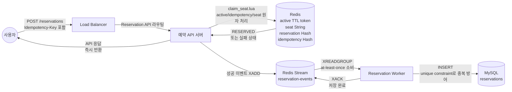
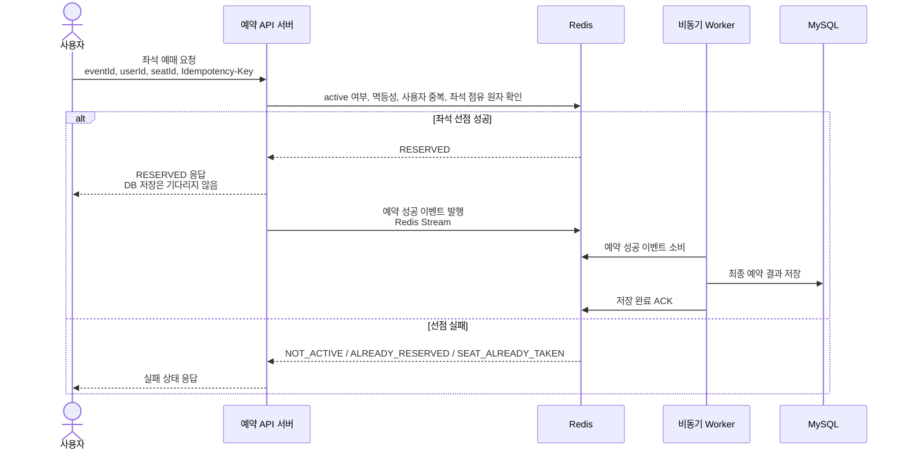
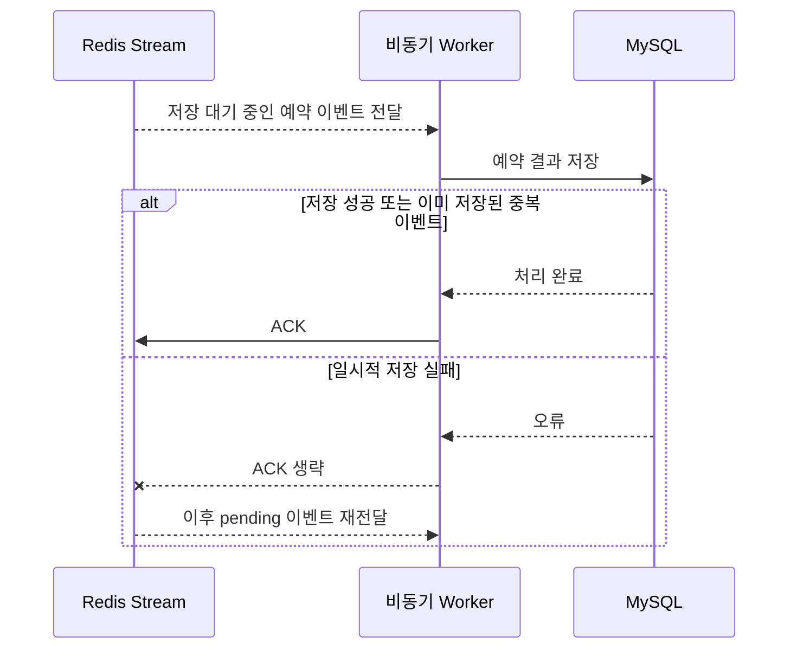

# Flow 4 — 사용자가 좌석을 예매하는 과정 + Redis Stream으로 DB에 전달되는 과정

## 개요

입장 허가를 받은 사용자가 HTTP 요청 하나로 좌석을 선점합니다. 모든 비즈니스 로직(입장 확인, 멱등성 검사, 좌석 중복 확인, 좌석 선점)은 Redis Lua 스크립트 하나에서 원자적으로 처리됩니다. MySQL은 hot path에서 전혀 개입하지 않습니다.

선점 성공 후 이벤트를 Redis Stream에 발행하면, 백그라운드 워커가 스트림을 소비해 MySQL에 비동기로 저장합니다.

이 플로우는 두 파트로 구성됩니다.

- **Part A**: 사용자의 예매 요청부터 API 응답, 비동기 저장 이벤트 발행까지의 전체 데이터 플로우
- **Part B**: Redis Stream 이벤트가 MySQL에 저장되는 비동기 영속화 플로우

---

## 상호작용 요약



---

## Part A: 좌석 예매 데이터 플로우



---

## Part B: 비동기 영속화 (Redis Stream → MySQL)



---

## 멱등성 아키텍처

멱등성은 **두 개의 독립적인 계층**에서 보장됩니다.

```
계층 1: Redis (claim_seat.lua)
  ┌─────────────────────────────────────────────────────┐
  │  idempotency:{eventId}:{userId}:{key}   Hash        │
  │  TTL = 600s                                          │
  │  대상: 10분 이내 클라이언트 재시도                   │
  └─────────────────────────────────────────────────────┘

계층 2: MySQL (스키마 제약)
  ┌─────────────────────────────────────────────────────┐
  │  UNIQUE (event_id, user_id)                          │
  │  UNIQUE (event_id, seat_id)                          │
  │  대상: Redis Stream at-least-once 중복 전달          │
  └─────────────────────────────────────────────────────┘
```

Redis 계층은 active 창 내에서의 클라이언트 재시도를 처리합니다. MySQL 제약은 워커 재시작으로 인해 ACK 유실 후 동일 이벤트가 재전달되는 경우를 처리합니다.

---

## 펜딩 메시지 복구 시나리오

`reclaimAndProcess`는 다음 장애 시나리오를 처리합니다.

```
1. 워커가 스트림에서 메시지 읽음 (XREADGROUP)
2. 워커가 MySQL 저장 시작
3. 워커 프로세스가 저장 도중 크래시
4. 메시지가 펜딩 목록에 남음 (ACK 안 됨)
5. 워커 재시작 → @PostConstruct에서 컨슈머 그룹 재확인
6. reclaimAndProcess가 30초 이상 idle인 메시지 발견
7. XCLAIM으로 소유권 획득 → 재처리
8. MySQL unique constraint가 행이 이미 커밋됐다면 중복을 흡수
```

---

## 예매 성공 후 Redis 상태

```
active:{eventId}:{userId}              STRING  (유지 중, TTL 계속 카운트다운)
seat:{eventId}:seat-1500               STRING  "user-42"
reservation:user:{eventId}:{userId}    HASH    { seatId: "seat-1500", status: "RESERVED", reservedAt: "..." }
idempotency:{eventId}:{userId}:{key}   HASH    { status: "RESERVED", seatId: "seat-1500", ... }  TTL=600s
reservation-events                     STREAM  { ..., { reservationId, eventId, userId, seatId, ... } }
```

**비동기 영속화 완료 후 MySQL**

```sql
INSERT INTO reservations (id, event_id, user_id, seat_id, status, reserved_at, idempotency_key, created_at)
VALUES ('uuid', 'event-1', 'user-42', 'seat-1500', 'RESERVED', '2025-05-12T...Z', 'idem-key', NOW());
```

---

## 응답 상태별 설명

| 상태 | 설명 |
|---|---|
| `RESERVED` | 좌석 선점 성공 (신규 또는 멱등성 재생) |
| `NOT_ACTIVE` | 입장 허가 창(60초)이 만료된 뒤 예매 시도 |
| `ALREADY_RESERVED` | 동일 이벤트에서 이미 다른 좌석을 예약한 사용자 |
| `SEAT_ALREADY_TAKEN` | 다른 사용자가 먼저 해당 좌석을 선점 |
| `INVALID_SEAT` | 좌석 ID 형식 오류 또는 범위 초과 (Redis 호출 없음) |

## 오류 케이스

| 조건 | HTTP 상태 | 에러 코드 |
|---|---|---|
| `Idempotency-Key` 헤더 누락 | 400 | `INVALID_REQUEST` |
| `Idempotency-Key` 120자 초과 | 400 | `BAD_REQUEST` |
| `userId` / `seatId` 값 없음 | 400 | `BAD_REQUEST` |
| Redis 연결 불가 | 500 | `INTERNAL_ERROR` |

---

## 기술적 하이라이트

### 단일 Lua 스크립트로 4가지 조건을 원자 처리

관련 구현: [claim_seat.lua](src/main/resources/lua/claim_seat.lua), [RedisReservationRepository.java](src/main/java/com/example/ticketing/reservation/infrastructure/RedisReservationRepository.java)

좌석 선점에는 동시에 참이어야 하는 조건이 네 가지 있습니다. active 상태 확인, idempotency 캐시 확인, 사용자 중복 예약 확인, 좌석 점유 여부 확인입니다. Java 레벨에서 Redis 명령을 순차 호출하면 각 명령 사이마다 다른 요청이 끼어들어 상태가 바뀔 수 있습니다. Lua 스크립트는 Redis 서버가 단일 명령처럼 실행하므로 이 4가지 상태가 항상 일관되게 평가됩니다. 결과적으로 좌석 중복, 사용자 중복 예약이 시스템 수준에서 불가능합니다.

### 2계층 멱등성 — 클라이언트 재시도와 스트림 재전달을 각각 방어

관련 구현: [claim_seat.lua](src/main/resources/lua/claim_seat.lua), [ReservationEntity.java](src/main/java/com/example/ticketing/reservation/persistence/ReservationEntity.java), [ReservationPersistenceWorker.java](src/main/java/com/example/ticketing/reservation/persistence/ReservationPersistenceWorker.java)

멱등성 문제의 원인이 두 가지로 다릅니다.

- **클라이언트 재시도**: 네트워크 타임아웃으로 응답을 못 받은 클라이언트가 같은 요청을 다시 보냅니다. → Redis idempotency Hash(TTL 600s)가 이전 결과를 그대로 반환합니다.
- **스트림 재전달**: 워커가 MySQL 저장 후 XACK 전에 크래시나면 동일 메시지가 재전달됩니다. → MySQL UNIQUE(event_id, user_id), UNIQUE(event_id, seat_id) 제약이 중복 INSERT를 차단합니다.

각 계층이 독립적으로 동작하므로 어느 하나가 실패해도 전체 멱등성이 유지됩니다.

### 선택적 XACK — at-least-once 보장의 핵심

관련 구현: [ReservationPersistenceWorker.java](src/main/java/com/example/ticketing/reservation/persistence/ReservationPersistenceWorker.java)

워커가 MySQL에 저장하다가 DB 타임아웃이나 연결 오류로 실패하면 XACK를 하지 않습니다. 메시지가 pending 목록에 남아 `pendingIdleMs`(기본값 30초) 후 `reclaimAndProcess`가 XCLAIM으로 소유권을 가져와 재처리합니다. DataIntegrityViolationException(중복)과 성공만 XACK 합니다. 이 설계는 at-least-once 전달을 외부 오케스트레이터 없이 Redis Stream 자체 메커니즘으로 구현합니다.

### DB를 핫 패스에서 완전히 제거 — 예매 폭발 구간 보호

관련 구현: [SeatReservationService.java](src/main/java/com/example/ticketing/reservation/application/SeatReservationService.java), [RedisReservationRepository.java](src/main/java/com/example/ticketing/reservation/infrastructure/RedisReservationRepository.java), [ReservationEventPublisher.java](src/main/java/com/example/ticketing/reservation/persistence/ReservationEventPublisher.java)

예매 API 응답은 Redis 선점 결과를 즉시 반환합니다. MySQL INSERT는 그 이후 백그라운드 워커가 처리합니다. 좌석 선점이 가장 많이 몰리는 개장 직후 수 초 동안 예매 API는 DB 커넥션을 단 한 개도 사용하지 않습니다. DB 커넥션 풀 소진, 락 경합, INSERT 병목이 사용자 응답 시간에 영향을 주지 않습니다.
