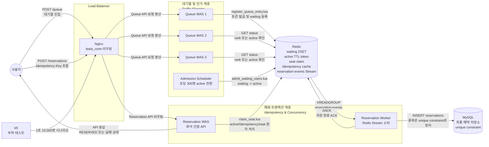

# Ticketing Traffic Lab

명절 기차표 예매처럼 특정 시각에 사용자가 한꺼번에 몰리는 상황을 직접 구현하고, 대기열 기반 트래픽 제어와 좌석 선점 정합성을 부하 테스트로 검증한 프로젝트입니다.

## 왜 이 프로젝트를 만들었나

티켓팅 서비스의 핵심 문제는 "10만 명의 요청을 받되, 2,000석만 판매해야 한다"는 것입니다. 이를 모든 요청을 DB로 보내는 방식으로 처리하면 DB는 즉시 과부하로 다운됩니다. 이 프로젝트는 그 문제를 세 가지 계층으로 분리해 해결합니다.

1. **대기열로 트래픽을 흡수**: 모든 요청을 Redis에서 받아 DB에 전달하지 않는다.
2. **입장 허가로 흐름을 제어**: 초당 설정된 인원만 예매 구간으로 진입시킨다.
3. **Lua 스크립트로 선점 정합성 보장**: DB 없이 Redis 안에서 원자적으로 좌석을 선점한다.

---

## 서비스 개요

### 핵심 시나리오

```
개장 시각, 10,000명이 동시에 "예매하기" 버튼을 누른다.
  │
  ├─ 모든 요청이 Redis 대기열에 등록된다 (MySQL 접근 없음)
  │
  ├─ 스케줄러가 초당 300명씩 예매 가능 상태(active)로 전환한다
  │    └─ 나머지는 폴링으로 자신의 순번을 확인하며 대기한다
  │
  ├─ active 사용자가 좌석을 선택하면 Redis Lua 스크립트가 원자적으로 처리한다
  │    ├─ active 여부 확인
  │    ├─ 멱등성 재생 (동일 요청 재시도)
  │    ├─ 사용자 중복 예약 방지
  │    └─ 좌석 선착순 선점 (race condition 없음)
  │
  └─ 선점 성공 이벤트가 Redis Stream에 발행된다
       └─ 백그라운드 워커가 MySQL에 비동기로 저장한다
```

### 검증된 불변 조건

k6 10,000명 부하 테스트에서 매 실행마다 아래 조건이 모두 성립합니다.

| 조건 | 결과 |
|---|---|
| 예매 성공 수 ≤ 좌석 수(2,000) | 항상 만족 |
| 동일 좌석 중복 예매 | 0건 |
| 동일 사용자 중복 예매 | 0건 |
| Redis 예약 수 = MySQL 저장 수 | 항상 일치 |

---

## 기술 스택

| 구분 | 기술 |
|---|---|
| 언어 / 프레임워크 | Java 21, Spring Boot 3 |
| 실시간 상태 저장소 | Redis — Sorted Set, Hash, String, Set, Stream |
| 영속 저장소 | MySQL |
| 원자성 보장 | Redis Lua Script (`claim_seat.lua`, `admit_waiting_users.lua`, `register_queue_entry.lua`) |
| 비동기 전달 | Redis Stream + Consumer Group (at-least-once) |
| 로컬 실행 환경 | Docker Compose (nginx 로드밸런서 + 다중 WAS) |
| 부하 테스트 | k6 |
| 통합 테스트 | Testcontainers |

---

## 아키텍처



### 저장소 역할 요약

Redis는 실시간 트래픽을 받아내는 상태 저장소입니다.

- `waiting ZSET`: 대기열입니다. 사용자별 진입 순서를 score로 저장하고, `ZRANK`로 대기순번을 조회합니다.
- `active TTL token`: 예매 가능 입장권입니다. 스케줄러가 대기열 앞쪽 사용자를 active로 전환하고, TTL이 지나면 자동 만료됩니다.
- `seat claim`: 좌석 선점 상태입니다. `seat:{eventId}:{seatId}` 키로 어떤 사용자가 좌석을 선점했는지 저장합니다.
- `idempotency cache`: 같은 `Idempotency-Key`로 재시도한 예매 요청에 최초 결과를 그대로 돌려주기 위한 캐시입니다.
- `reservation-events Stream`: 좌석 선점 성공 이벤트를 MySQL 저장 worker에게 넘기는 Redis Stream입니다.

MySQL은 최종 예약 결과를 보관하는 영속 저장소입니다.

- `최종 예약 저장소`: Redis에서 선점에 성공한 예약만 `reservations` 테이블에 저장합니다.
- `unique constraint`: 같은 이벤트에서 동일 사용자 또는 동일 좌석이 중복 저장되지 않도록 최종 방어선 역할을 합니다.

---

## 플로우별 문서

각 플로우 문서 말미에는 해당 구현에서 주목할 만한 기술적 설계 결정을 정리해두었습니다.

| 순서 | 문서 | 내용 |
|---|---|---|
| 1 | [Flow 1 — 대기열 등록](FLOW_1_QUEUE_ENTRY.md) | Lua 원자 등록, Score 설계, DB-Free 핫 패스 |
| 2 | [Flow 2 — 순번 확인](FLOW_2_TOKEN_STATUS_CHECK.md) | Stateless 폴링, eventId 교차 검증, 상태 판별 순서 |
| 3 | [Flow 3 — 입장 허가](FLOW_3_ADMISSION_SCHEDULER.md) | ZREM 멱등 가드, TTL 상태 관리, fixedRate 선택 이유 |
| 4 | [Flow 4 — 좌석 예매](FLOW_4_SEAT_RESERVATION.md) | 4-way 원자 Lua, 2계층 멱등성, 선택적 XACK |
| 5 | [Redis 사용 설계](REDIS_DATA_STRUCTURES.md) | Redis를 대기열, active 토큰, 좌석 선점, 멱등성, Stream 큐로 사용한 방식 |
| 6 | [Kafka와 Redis Streams 비교](docs/kafka-vs-redis-streams.md) | 왜 현재 구현에서 Redis Streams를 선택했는지 |
| 7 | [전체 아키텍처](docs/architecture.md) | 레이어 구조, API 경계, Redis/MySQL 책임 분리 |
| 8 | [로컬 Multi-WAS 실행 구조](docs/local-multi-was.md) | nginx 뒤 Queue WAS 3대와 Reservation WAS 구성을 재현하는 방법 |
| 9 | [1차 부하 테스트 분석](docs/load-test-analysis.md) | 1만/3만 요청 실험에서 병목을 추적한 과정 |
| 10 | [최종 부하 테스트 결과](docs/load-test-results/reservation-flow-10000-20260513.md) | k6 10,000명 대기열-예매 통합 시나리오 실행 결과 |

---

## 핵심 설계 원칙

**DB는 hot path에서 완전히 제거한다.** 대기열 등록(Flow 1), 순번 확인(Flow 2), 입장 허가(Flow 3), 좌석 선점(Flow 4) 모두 MySQL을 호출하지 않습니다. 좌석 선점이 가장 폭발적으로 몰리는 개장 직후 수 초 동안 예매 API는 DB 커넥션을 단 한 개도 사용하지 않습니다.

**원자성은 Lua로, 멱등성은 두 계층으로.** 복합 조건의 원자 처리는 Redis Lua 스크립트로, 클라이언트 재시도는 Redis idempotency Hash로, 스트림 재전달은 MySQL UNIQUE 제약으로 방어합니다.

**자기 회복 설계.** 워커 크래시로 XACK 전에 종료되면 메시지가 pending에 남고, 재시작 후 `reclaimAndProcess`가 외부 도구 없이 자동으로 재처리합니다.

---

## 다루지 않는 것

- 실제 결제, 회원, 인증, 운영 배포
- 로컬 테스트 결과를 상용 트래픽 처리량으로 과장
- 처음부터 Kafka, Kubernetes, Redis Cluster 도입
