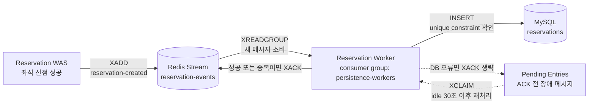

# Redis 사용 설계 문서

이 문서는 프로젝트에서 Redis를 어떤 책임으로 사용했는지 정리합니다. 단순 키 목록뿐 아니라, **어떤 Redis 특성을 이용해 어떤 로직을 해결했는지**, 그리고 Redis Stream이 비동기 영속화에서 어떤 역할을 하는지 함께 설명합니다.

---

## 설계 철학

이 시스템은 30,000명의 동시 접속자가 2,000석을 경쟁하는 환경을 전제합니다. 핵심 제약은 MySQL이 30,000건의 동시 쓰기를 감당할 수 없다는 것입니다. Redis는 MySQL 앞단에서 **트래픽 차단 및 상태 관리 계층**으로 동작합니다.

1. **대기열 입장 제어**: 초당 N명만 예매 시도 가능하도록 속도를 제한합니다.
2. **좌석 선점**: MySQL을 전혀 건드리지 않고 Redis Lua 스크립트 안에서 완전히 처리합니다.
3. **멱등성 보장**: Redis에서 결과를 캐싱하므로 클라이언트 재시도가 MySQL에 중복 데이터를 만들지 않습니다.

모든 Redis 사용은 네 가지 관심사 중 하나에서 비롯됩니다: **원자성**, **O(1) 접근**, **네이티브 TTL 지원**, **비동기 이벤트 전달**.

---

## Redis가 맡는 전체 역할

| 역할 | 사용한 Redis 특성 | 적용 로직 | 설계 의도 |
|---|---|---|---|
| 대기열 순서 보장 | Sorted Set score 정렬, `ZRANK`, `ZRANGE` | 먼저 들어온 사용자를 먼저 active로 전환 | DB 없이 대기순번 조회와 일괄 입장 처리를 동시에 만족 |
| 중복 대기열 진입 차단 | String 역색인, Lua 원자 실행 | 같은 `eventId/userId`는 기존 queue token 재사용 | 더블 클릭이나 재시도에도 대기 위치가 하나만 생기도록 보장 |
| active 입장권 | String TTL, `EXISTS`, `TTL` | 입장 허가 후 제한 시간 안에만 예매 가능 | 포기한 사용자를 별도 배치 없이 자동 만료 |
| active 사용자 관찰 | Sorted Set score를 만료 시각으로 사용 | 현재 active 사용자 수 조회, 만료 항목 정리 | `SCAN active:*` 없이 이벤트별 active 수를 효율적으로 계산 |
| 좌석 선점 | Lua script, String `GET/SET` | 좌석 중복 확인과 선점을 하나의 원자 단위로 처리 | 같은 좌석에 여러 요청이 몰려도 단 한 명만 성공 |
| 사용자 중복 예매 방지 | Hash, Lua script | 같은 이벤트에서 사용자당 하나의 좌석만 허용 | 좌석을 바꿔가며 여러 번 성공하는 상황 방지 |
| 클라이언트 재시도 멱등성 | Hash + TTL | 같은 `Idempotency-Key`는 최초 결과를 그대로 반환 | 네트워크 재시도나 타임아웃에도 좌석을 다시 선점하지 않음 |
| 비동기 영속화 | Redis Stream, Consumer Group, Pending Entry, `XACK` | Redis 선점 성공 이벤트를 MySQL worker로 전달 | API 응답 경로에서 MySQL 쓰기를 제거하고 worker 장애 시 재처리 |
| 운영/테스트 메트릭 | String counter, `INCR`, `INCRBY` | 등록 수, admission 수, 만료 조회 수 집계 | 동시성 안전한 단순 카운터를 Redis에서 처리 |

Redis는 이 프로젝트에서 캐시만이 아닙니다. 사용자 흐름의 앞단에서는 **트래픽 제어 장치**, 예매 구간에서는 **동시성 제어 장치**, 저장 구간에서는 **비동기 이벤트 큐**로 사용됩니다. MySQL은 최종 예약 결과의 영속 저장소이며, 가장 부하가 큰 hot path에서는 호출되지 않습니다.

---

## 전체 키 목록

| 키 패턴 | 자료구조 | 주요 연산 |
|---|---|---|
| `waiting:{eventId}` | Sorted Set | 순서 기반 대기열: ZRANK로 순번 조회, ZRANGE로 일괄 입장 처리 |
| `queue-token:{token}` | Hash | 토큰 메타데이터(eventId, userId, createdAt) 단일 조회 |
| `queue-user-token:{eventId}:{userId}` | String | 역색인: GET 으로 O(1) 중복 진입 차단 |
| `queue-events` | Set | 활성 이벤트 레지스트리: KEYS 스캔 없이 이벤트 목록 관리 |
| `active:{eventId}:{userId}` | String (TTL) | 입장 허가 창: Redis 네이티브 TTL이 자동 만료 처리 |
| `active-users:{eventId}` | Sorted Set | Score = 만료 epoch: ZREMRANGEBYSCORE로 만료 항목 정리 |
| `seat:{eventId}:{seatId}` | String | 좌석 점유자: Lua 안에서 원자적 SET/GET |
| `reservation:user:{eventId}:{userId}` | Hash | 예약 상세 정보: HGET으로 필드 단위 조회 |
| `idempotency:{eventId}:{userId}:{key}` | Hash | 결과 캐시: 다중 필드 + TTL을 하나의 키로 관리 |
| `queue-metrics:registered` | String | 원자 카운터: INCR |
| `queue-metrics:admitted` | String | 원자 카운터: INCRBY (배치 증가) |
| `queue-metrics:expired-lookup` | String | 원자 카운터: INCR |
| `reservation-events` | Stream | 이벤트 큐: 컨슈머 그룹 + ACK로 at-least-once 보장 |

---

## 1. `waiting:{eventId}` — Sorted Set

**목적**: 메인 대기열. Score 순서(입장 시각)로 정렬되어 먼저 들어온 사용자가 먼저 입장합니다(FIFO).

**왜 Sorted Set인가?**

이 키에서 핵심적으로 필요한 두 가지 연산이 있습니다.

- **순번 조회** (`ZRANK`): O(log N). 폴링 중인 사용자가 전체 스캔 없이 자신의 순번을 바로 받아볼 수 있습니다.
- **일괄 입장 처리** (`ZRANGE 0 N-1`): O(log N + N). 스케줄러가 가장 오래된 N명을 시간 순서대로 단일 명령으로 읽어냅니다.

**Score 설계**: `epochMilli + (인스턴스별 시퀀스 / 1_000_000)`. 같은 밀리초에 수천 명이 동시에 진입하면 동일 Score가 충돌하고, ZSET은 member(userId) 사전순으로 정렬합니다. 소수점 이하에 단조증가 시퀀스를 더해 실제 도착 순서를 밀리초 내에서도 안정적으로 유지합니다.

`ZADD NX` 플래그로 재시도 요청이 기존 member의 Score를 덮어쓸 수 없게 합니다. 사용자마다 딱 하나의 안정적인 대기 위치만 존재합니다.

**List를 쓰지 않은 이유**: `LPOS`로 순번을 찾으면 O(N)입니다. FIFO 팝은 단순하지만, 폴링 클라이언트가 필요로 하는 임의 위치 조회가 불가능합니다.

**단순 큐(LPUSH/BRPOP)를 쓰지 않은 이유**: 위치 조회를 위해 별도 자료구조가 필요해집니다. Sorted Set 하나로 읽기(ZRANK)와 일괄 입장(ZRANGE + ZREM) 모두를 처리합니다.

---

## 2. `queue-token:{token}` — Hash

**목적**: UUID 폴링 토큰을 `(eventId, userId, createdAt)`으로 변환합니다.

**왜 Hash인가?**

토큰은 항상 세 필드를 함께 읽습니다. `HGETALL` 하나로 단일 왕복에 모두 가져옵니다. 각 필드를 별도 String 키로 저장하면 GET 세 번 또는 파이프라인이 필요합니다.

`EXPIRE` 한 번으로 모든 필드의 TTL을 원자적으로 관리합니다. 필드 하나만 먼저 만료될 위험이 없습니다.

**String(JSON)을 쓰지 않은 이유**: JSON 파싱은 느리고 스키마가 경직됩니다. Hash는 `HSET`으로 새 필드를 하위 호환으로 추가할 수 있고, JSON은 파싱 후 전체 구조를 처리해야 합니다.

---

## 3. `queue-user-token:{eventId}:{userId}` — String

**목적**: `(eventId, userId)` → 토큰 UUID 역색인. 동일 사용자의 중복 대기열 진입을 차단하는 게이트입니다.

**왜 String인가?**

연산이 `GET`(기존 확인)과 `SET EX`(TTL과 함께 저장) 둘뿐입니다. 단일 키-값 매핑 + TTL에는 String이 가장 직접적입니다.

`register_queue_entry.lua` 스크립트가 이 키를 먼저 읽습니다. 이미 존재하면 기존 토큰을 그대로 반환하고 waiting ZSET을 건드리지 않습니다. 동시에 같은 사용자 요청이 여러 개 들어와도 하나의 대기 위치로 수렴합니다.

**이중 검증**: 역색인에서 토큰을 찾은 뒤, `findExistingToken()`이 토큰 Hash도 확인해 역색인 키의 TTL이 토큰 Hash보다 조금 늦게 만료되어 다른 사용자의 토큰이 잘못 반환되는 상황을 막습니다.

---

## 4. `queue-events` — Set

**목적**: 현재 대기열에 사용자가 있는 이벤트 ID 레지스트리. 입장 스케줄러가 모든 Redis 키를 스캔하는 대신 이 Set을 순회합니다.

**왜 Set인가?**

- `SADD`는 멱등합니다. 같은 `eventId`를 두 번 추가해도 안전하며, 대기열 진입마다 호출됩니다.
- `SMEMBERS`는 전체 사용자 수가 아닌 이벤트 수에 비례한 O(|events|)로 목록을 반환합니다.
- **핵심**: `KEYS waiting:*`은 Redis 키스페이스 전체에 대해 O(N) 블로킹 연산입니다. Set 레지스트리가 이를 완전히 대체합니다.

**Sorted Set을 쓰지 않은 이유**: 이벤트 간 순서가 필요 없습니다. Plain Set이 메모리도 적게 씁니다.

---

## 5. `active:{eventId}:{userId}` — String (TTL)

**목적**: 사용자가 좌석 예매를 시도할 수 있는 입장 허가 창을 나타냅니다.

**왜 String(TTL 키)인가?**

"활성 입장"의 의미 자체가 시간 제한 플래그입니다. Redis 네이티브 TTL이 정확히 그것입니다. 별도 만료 처리 로직이 필요 없고, TTL이 다하면 키가 사라집니다. 다음 `EXISTS` 호출이 0을 반환하고 시스템은 이를 `NOT_ACTIVE`로 처리합니다.

값으로는 `enteredAt` epoch 밀리초를 저장합니다(감사 로그용). 만료 로직은 값이 아닌 TTL이 구동합니다.

`claim_seat.lua`가 `EXISTS active:{eventId}:{userId}`를 확인합니다. 60초 창이 닫힌 뒤 사용자가 예매를 시도하면 `EXISTS`가 0을 반환하고 `NOT_ACTIVE`로 거부됩니다.

**별도 만료 잡을 쓰지 않은 이유**: ZSET + 수동 만료 방식은 별도 백그라운드 잡이 필요합니다. TTL String은 유지보수가 필요 없고 만료가 원자적으로 처리됩니다.

---

## 6. `active-users:{eventId}` — Sorted Set

**목적**: 입장 허가된 사용자를 만료 시각(Score)으로 추적하여, 시간 기반 정리와 정확한 메트릭을 제공합니다.

**왜 Sorted Set인가?**

`ZREMRANGEBYSCORE active-users:{eventId} 0 nowEpochMillis` 한 번으로 만료된 항목을 O(log N + M)에 제거합니다. `QueueMetricsService`가 이 명령으로 만료 항목을 먼저 제거한 뒤 `ZCARD`로 실시간 활성 사용자 수를 셉니다.

**Score = 만료 epoch 밀리초**: "과거 시각인 항목 전부 제거"라는 쿼리가 `ZREMRANGEBYSCORE`의 범위 조건으로 자연스럽게 표현됩니다.

---

## 7. `seat:{eventId}:{seatId}` — String

**목적**: 좌석 점유 기록. 값은 해당 좌석을 선점한 userId입니다.

**왜 String인가?**

Lua 스크립트가 `GET seatKey`로 점유 여부를 확인하고, `SET seatKey userId`로 선점합니다. 단순 연산에는 단순 자료구조가 최적입니다. 점유자는 스칼라 값 하나면 충분합니다.

이 키를 예약 Hash와 분리함으로써, 좌석 점유 확인은 예약 Hash의 필드 수에 관계없이 항상 O(1)입니다.

---

## 8. `reservation:user:{eventId}:{userId}` — Hash

**목적**: 사용자의 예약 상태(어떤 좌석, 상태 값, 예약 시각)를 저장합니다.

**왜 Hash인가?**

`seatId`, `status`, `reservedAt` 여러 필드를 함께 읽고 씁니다. `HGETALL`이 단일 명령으로 전체 필드를 반환합니다. `HGET reservationUserKey seatId`는 Lua 스크립트 안에서 중복 예약을 확인할 때 전체 Hash를 읽지 않고 필드 하나만 꺼내옵니다.

**TTL을 설정하지 않은 이유**: 예약은 영구 비즈니스 데이터입니다. MySQL이 최종 저장소이고 Redis는 핫 캐시입니다. TTL을 설정하면 Redis 캐시가 만료된 뒤에도 MySQL에 레코드가 남아, 조회 API가 불일치한 결과를 반환하게 됩니다.

---

## 9. `idempotency:{eventId}:{userId}:{idempotencyKey}` — Hash

**목적**: 예매 시도 결과를 캐싱하여, 동일 키로 재시도하는 클라이언트에게 동일한 응답을 반환합니다. 클레임 로직을 재실행하지 않습니다.

**왜 Hash인가?**

캐시 결과가 `status`, `seatId`, `message`, `requestSeatId`, `createdAt` 여러 필드로 구성됩니다. Hash 하나로 모든 필드를 하나의 TTL 키에 묶습니다.

**멱등성 범위에 userId 포함**: 동일한 `Idempotency-Key` 헤더를 두 다른 사용자가 보내도 결과를 공유하지 않습니다.

성공뿐 아니라 실패 결과도 캐싱합니다. 첫 시도에서 좌석이 이미 점유된 경우, 같은 키로 재시도할 때 다시 클레임을 시도하지 않고 `SEAT_ALREADY_TAKEN`을 그대로 반환해야 하기 때문입니다.

---

## 10. `queue-metrics:*` — String (카운터)

**목적**: 등록 사용자 수, 입장 허가 수, 만료 조회 수를 단조증가 카운터로 기록합니다.

**왜 String인가?**

`INCR`과 `INCRBY`는 원자 연산이므로 동시 접근에서도 별도 락이 필요 없습니다. Redis String 카운터는 공유 스레드 안전 카운터의 관용적 패턴입니다.

`queue-metrics:admitted`에는 `INCRBY`를 사용합니다. 스케줄러가 한 틱에 최대 300명을 일괄 허가하므로, `INCR`을 300번 호출하는 대신 `INCRBY 300` 한 번으로 처리합니다.

---

## 11. `reservation-events` — Stream

**목적**: API 응답(즉시)과 MySQL 저장(비동기)을 분리하는 내구성 있는 이벤트 로그입니다. 좌석 선점 자체는 `claim_seat.lua`가 Redis 안에서 끝내고, Stream은 "선점에 성공했으니 최종 저장소에 반영하라"는 이벤트를 전달합니다.

**왜 Stream인가?**

Stream은 단순 자료구조가 제공하지 못하는 두 가지 기능을 제공합니다.

| 기능 | Stream | List (LPUSH/BRPOP) | Pub/Sub |
|---|---|---|---|
| 컨슈머 그룹 | ✓ | ✗ | ✗ |
| ACK / 펜딩 추적 | ✓ | ✗ | ✗ |
| 임의 ID부터 재생 | ✓ | ✗ | ✗ |
| 재시작 후 지속성 | ✓ | ✓ | ✗ |

**컨슈머 그룹** (`persistence-workers`): 여러 워커 인스턴스가 부하를 나눌 수 있습니다. 하나의 메시지는 같은 그룹 안에서 하나의 컨슈머에게 전달되지만, ACK 전에 장애가 나면 다시 전달될 수 있으므로 전체 처리 모델은 at-least-once입니다.

**펜딩 메시지 복구**: 워커가 메시지를 읽고 ACK 하기 전에 크래시하면 메시지가 펜딩 목록에 남습니다. `XPENDING` + `XCLAIM`으로 일정 시간(기본 30초) 이상 유휴 상태인 메시지를 다시 소유해 재처리합니다.

**At-least-once 보장**: MySQL의 유니크 제약 (`UNIQUE (event_id, user_id)`, `UNIQUE (event_id, seat_id)`)과 결합하여, 중복 스트림 전달은 persistence 계층에서 조용히 흡수됩니다. 제약 위반 예외는 `WARN`으로 로깅하고 건너뜁니다.

