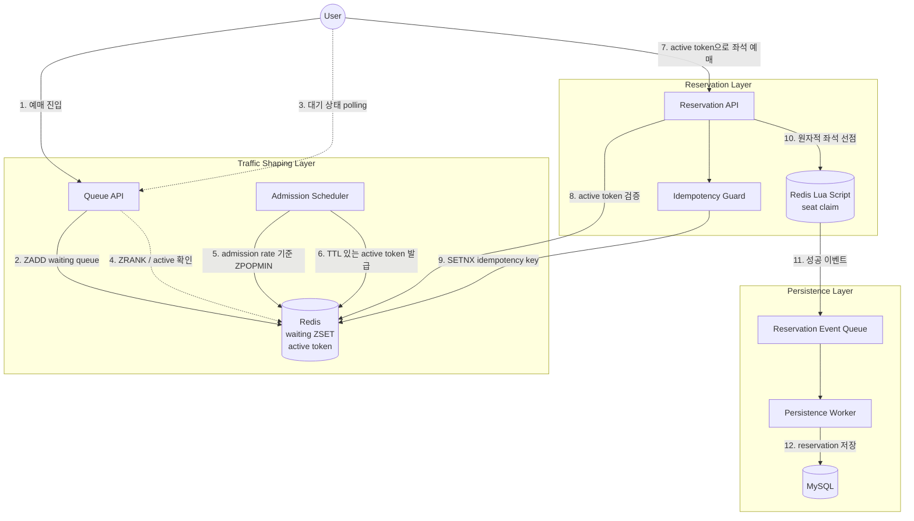

# Architecture

이 문서는 명절 기차표 예매 상황을 가정한 대용량 트래픽 제어 시스템의 전체 아키텍처를 설명합니다.

목표는 30,000명의 동시 진입 요청을 모두 예매 트랜잭션으로 보내지 않고, 대기열과 입장 제어를 통해 시스템이 감당 가능한 만큼만 처리하는 것입니다.

## 시스템 컨텍스트



## 핵심 설계

### 1. 대기열 입장

사용자는 예매 이벤트에 진입할 때 바로 좌석 예매 API로 이동하지 않습니다.

Queue API는 `eventId`, `userId`를 기준으로 사용자를 Redis Sorted Set에 등록합니다.

```text
waiting:{eventId}
type: ZSET
member: userId
score: request timestamp
```

대기열은 다음 요구사항을 만족해야 합니다.

- 먼저 진입한 사용자가 먼저 입장한다.
- 사용자는 자신의 대기 순번을 조회할 수 있다.
- 동일 이벤트에 동일 사용자가 중복 등록되지 않는다.
- 대기열 등록과 상태 조회는 MySQL을 사용하지 않는다.
- Redis `KEYS` 명령어를 사용하지 않는다.

### 2. Active Token

Admission Scheduler는 설정된 admission rate에 따라 대기열에서 사용자를 꺼내 active token을 발급합니다.

```text
active:{eventId}:{userId}
type: String
ttl: 기본 60초
```

active token은 예매 API 호출 권한입니다.

TTL이 필요한 이유:

- 입장 후 브라우저를 닫은 사용자가 영원히 자리를 점유하지 않게 한다.
- 예매 계층으로 들어오는 요청량을 시간 단위로 제한한다.
- 포기한 사용자를 자동으로 정리한다.

### 3. 좌석 예매

좌석 수는 2,000석으로 제한합니다. 사용자는 active 상태가 된 뒤 5초 동안 무작위 좌석을 선택한다고 가정합니다.

좌석 선점은 Redis Lua Script로 처리합니다.

원자적으로 처리해야 하는 작업:

1. active token 유효성 확인
2. idempotency key 확인
3. 좌석이 이미 선점되었는지 확인
4. 좌석 선점 처리
5. 사용자별 예매 성공 기록

예상 key:

```text
seat:{eventId}:{seatId}
type: String
value: userId

reservation:user:{eventId}:{userId}
type: Hash
fields: seatId, status, reservedAt

idempotency:{eventId}:{userId}:{key}
type: String
value: processing | succeeded | failed
ttl: configurable
```

현재 `002-seat-reservation` 기능은 full `Idempotency-Key` 처리를 후속 기능으로 남겨두고, 먼저 `reservation:user:{eventId}:{userId}`로 동일 사용자의 다중 좌석 선점을 막는다. 좌석 선점은 `claim_seat.lua`에서 다음 조건을 한 번에 검사한다.

1. `active:{eventId}:{userId}` 존재 여부
2. 기존 `reservation:user:{eventId}:{userId}` 존재 여부
3. 기존 `seat:{eventId}:{seatId}` 소유자 존재 여부
4. 성공 시 seat key와 user reservation hash 기록

이 경로는 MySQL을 호출하지 않고 Redis `KEYS` 명령을 사용하지 않는다.

### 4. 비동기 영속화

Redis에서 좌석 선점이 성공하면 API는 성공 응답을 빠르게 반환하고, 예매 성공 이벤트를 비동기 저장 계층으로 전달합니다.

초기 구현에서는 Redis Stream 또는 내부 queue를 사용할 수 있습니다. 포트폴리오 관점에서는 Redis Stream을 우선 고려합니다.

```text
reservation-events:{eventId}
type: Redis Stream
```

Persistence Worker는 MySQL이 감당 가능한 속도로 이벤트를 소비하고 저장합니다.

DB에 저장할 주요 데이터:

- reservation id
- event id
- user id
- seat id
- reservation status
- reserved at
- idempotency key

## API 초안

### Queue API

```http
POST /api/events/{eventId}/queue
Content-Type: application/json

{
  "userId": "user-1"
}
```

```http
GET /api/events/{eventId}/queue/{queueToken}
```

상태 응답:

```json
{
  "status": "WAITING",
  "rank": 1240,
  "totalWaiting": 30000,
  "pollAfterSeconds": 5
}
```

```json
{
  "status": "ENTERED",
  "activeExpiresInSeconds": 60
}
```

### Reservation API

```http
POST /api/events/{eventId}/reservations
Idempotency-Key: request-uuid
Content-Type: application/json

{
  "userId": "user-1",
  "seatId": "A-10"
}
```

성공 응답:

```json
{
  "status": "RESERVED",
  "seatId": "A-10"
}
```

실패 응답 예:

```json
{
  "status": "SEAT_ALREADY_TAKEN"
}
```

```json
{
  "status": "NOT_ACTIVE"
}
```

## 핵심 불변조건

시스템은 다음 조건을 반드시 만족해야 합니다.

- 성공 예매 수는 전체 좌석 수를 초과할 수 없다.
- 동일 사용자는 동일 이벤트에서 하나의 좌석만 예매할 수 있다.
- active token이 없는 사용자는 좌석을 선점할 수 없다.
- Redis에서 성공한 예매 이벤트와 MySQL에 저장된 예매 결과는 최종적으로 일치해야 한다.
- 대기열과 예매 트랜잭션은 서로 분리되어야 한다.

## 로컬 실행 환경

로컬 개발 환경은 Docker Compose로 재현 가능해야 합니다.

예상 구성:

```text
application: Spring Boot
redis: Redis
mysql: MySQL
load-generator: k6 or local binary
```

초기에는 단일 애플리케이션 인스턴스로 시작하고, 병목이 확인되면 Queue API, Reservation API, Worker를 분리할 수 있도록 패키지 구조를 유지합니다.

## 확장 방향

로컬 프로젝트의 1차 목표는 구조와 정합성 검증입니다.

향후 확장 방향:

- 애플리케이션 서버 scale-out
- Redis Cluster 기반 eventId sharding
- Redis Stream에서 Kafka 또는 RabbitMQ로 교체
- Reservation Worker 분리
- polling 최적화 또는 SSE/WebSocket 도입
- Prometheus/Grafana 기반 지표 수집
