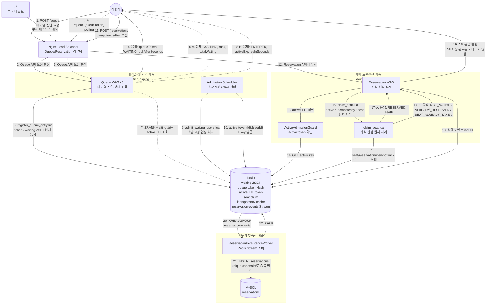

# 전체 아키텍처

이 문서는 명절 기차표 예매 상황을 가정한 대용량 트래픽 제어 시스템의 전체 아키텍처를 설명합니다.

목표는 30,000명의 동시 진입 요청을 모두 예매 트랜잭션으로 보내지 않고, 대기열과 입장 제어를 통해 시스템이 감당 가능한 만큼만 처리하는 것입니다.

## 시스템 컨텍스트



## 핵심 설계

전체 코드는 큰 틀에서 `api -> application -> infrastructure/persistence` 흐름을 따릅니다.

- `api`: HTTP 요청/응답 DTO와 controller를 둡니다.
- `application`: 유스케이스를 조율합니다. 입력 검증, repository 호출 순서, 응답 조립이 여기에 있습니다.
- `infrastructure`: Redis 자료구조와 Lua script 호출을 담당합니다.
- `persistence`: MySQL 엔티티와 Redis Stream worker처럼 최종 영속화와 관련된 코드를 둡니다.

이 프로젝트의 핵심 판단은 “동시성 판단은 Redis에서 빠르게 끝내고, MySQL은 성공 결과의 최종 저장소로만 사용한다”입니다.

### 1. 대기열 입장

사용자는 예매 이벤트에 진입할 때 바로 좌석 예매 API로 이동하지 않습니다.

Queue API는 `eventId`, `userId`를 기준으로 사용자를 Redis Sorted Set에 등록합니다.

```text
waiting:{eventId}
type: ZSET
member: userId
score: request timestamp
```

대기열은 다음 요구사항을 만족해야 합니다.

- 먼저 진입한 사용자가 먼저 입장한다.
- 사용자는 자신의 대기 순번을 조회할 수 있다.
- 동일 이벤트에 동일 사용자가 중복 등록되지 않는다.
- 대기열 등록과 상태 조회는 MySQL을 사용하지 않는다.
- Redis `KEYS` 명령어를 사용하지 않는다.

대기열 key model:

```text
waiting:{eventId}
type: ZSET
member: userId
score: request timestamp
purpose: oldest-first waiting queue

queue-token:{token}
type: HASH
fields: eventId, userId, createdAt
ttl: queue.token-ttl-seconds
purpose: polling token을 event/user로 해석

queue-user-token:{eventId}:{userId}
type: STRING
value: token
ttl: queue.token-ttl-seconds
purpose: 동일 event/user의 중복 진입에서 기존 token 재사용

queue-events
type: SET
member: eventId
purpose: scheduler가 Redis KEYS 없이 처리 대상 event를 찾는 registry
```

Queue API의 hot path는 위 key를 직접 지정해서 접근한다. event/user 중복 진입은 `queue-user-token:{eventId}:{userId}` reverse index로 기존 token을 찾고, scheduler는 `queue-events` registry를 읽어 이벤트 목록을 순회한다. 이 방식은 Redis keyspace 전체 탐색 없이 대기열 등록, 상태 조회, admission 처리를 수행하기 위한 경계다.

### 2. Active Token

Admission Scheduler는 설정된 admission rate에 따라 대기열에서 사용자를 꺼내 active token을 발급합니다.

```text
active:{eventId}:{userId}
type: String
ttl: 기본 60초
```

active token은 예매 API 호출 권한입니다.

TTL이 필요한 이유:

- 입장 후 브라우저를 닫은 사용자가 영원히 자리를 점유하지 않게 한다.
- 예매 계층으로 들어오는 요청량을 시간 단위로 제한한다.
- 포기한 사용자를 자동으로 정리한다.

Admission Scheduler는 매초 실행되며, 각 event의 `waiting:{eventId}`에서 오래 기다린 사용자부터 설정된 `queue.admission-rate-per-second`만큼 꺼낸다. Lua script는 waiting ZSET에서 pop한 사용자에게 `active:{eventId}:{userId}` TTL key를 만들고, 관찰용 `active-users:{eventId}` ZSET에도 만료 시각을 기록한다.

```text
active:{eventId}:{userId}
type: STRING
value: enteredAt
ttl: queue.active-ttl-seconds
purpose: Reservation API 진입 권한

active-users:{eventId}
type: ZSET
member: userId
score: active expiration epoch millis
purpose: 현재 active 사용자 수 관찰과 만료된 관찰 항목 정리
```

`ActiveAdmissionGuard`는 후속 reservation 기능의 경계다. Reservation API는 좌석 선점 전에 event/user 조합의 active key TTL을 확인하고, active admission이 없으면 예매를 진행하지 않는다. 즉, 대기열은 reservation을 직접 수행하지 않고 “예매 계층에 들어가도 되는 사용자만 통과시키는 권한”을 제공한다.

### 3. 좌석 예매

좌석 수는 2,000석으로 제한합니다. 사용자는 active 상태가 된 뒤 5초 동안 무작위 좌석을 선택한다고 가정합니다.

좌석 선점은 Redis Lua Script로 처리합니다.

원자적으로 처리해야 하는 작업:

1. active token 유효성 확인
2. idempotency key 확인
3. 좌석이 이미 선점되었는지 확인
4. 좌석 선점 처리
5. 사용자별 예매 성공 기록

예상 key:

```text
seat:{eventId}:{seatId}
type: String
value: userId

reservation:user:{eventId}:{userId}
type: Hash
fields: seatId, status, reservedAt

idempotency:{eventId}:{userId}:{key}
type: Hash
fields: status, seatId, message
ttl: configurable
```

현재 구현은 `reservation:user:{eventId}:{userId}`로 동일 사용자의 다중 좌석 선점을 막고, `idempotency:{eventId}:{userId}:{key}`에 최초 요청 결과를 저장해 같은 key 재시도는 같은 응답을 반환한다. 좌석 선점은 `claim_seat.lua`에서 다음 조건을 한 번에 검사한다.

1. `active:{eventId}:{userId}` 존재 여부
2. 기존 `idempotency:{eventId}:{userId}:{key}` replay 가능 여부
3. 기존 `reservation:user:{eventId}:{userId}` 존재 여부
4. 기존 `seat:{eventId}:{seatId}` 소유자 존재 여부
5. 성공 시 seat key, user reservation hash, idempotency hash 기록

이 경로는 MySQL을 호출하지 않고 Redis `KEYS` 명령을 사용하지 않는다.

### 4. 비동기 영속화

Redis에서 좌석 선점이 성공하면 API는 성공 응답을 빠르게 반환하고, 예매 성공 이벤트를 비동기 저장 계층으로 전달합니다.

현재 구현은 Redis Stream을 사용합니다. 좌석 선점이 성공하면 `ReservationEventPublisher`가 `reservation-events` stream에 이벤트를 추가하고, `ReservationPersistenceWorker`가 consumer group으로 이벤트를 읽어 MySQL에 저장합니다.

```text
reservation-events
type: Redis Stream
```

Persistence Worker는 MySQL이 감당 가능한 속도로 이벤트를 소비하고 저장합니다. 처리 중 worker가 중단되면 메시지는 pending 상태로 남고, idle 시간이 지난 pending 메시지는 다시 claim해서 재처리합니다. Redis Stream은 중복 전달 가능성을 완전히 없애는 장치가 아니므로 MySQL의 `event_id/user_id`, `event_id/seat_id` unique constraint가 최종 중복 방어선입니다.

DB에 저장할 주요 데이터:

- reservation id
- event id
- user id
- seat id
- reservation status
- reserved at
- idempotency key

## API 초안

### Queue API

```http
POST /api/events/{eventId}/queue
Content-Type: application/json

{
  "userId": "user-1"
}
```

```http
GET /api/events/{eventId}/queue/{queueToken}
```

상태 응답:

```json
{
  "status": "WAITING",
  "rank": 1240,
  "totalWaiting": 30000,
  "pollAfterSeconds": 5
}
```

```json
{
  "status": "ENTERED",
  "activeExpiresInSeconds": 60
}
```

### Reservation API

```http
POST /api/events/{eventId}/reservations
Idempotency-Key: request-uuid
Content-Type: application/json

{
  "userId": "user-1",
  "seatId": "A-10"
}
```

성공 응답:

```json
{
  "status": "RESERVED",
  "seatId": "A-10"
}
```

실패 응답 예:

```json
{
  "status": "SEAT_ALREADY_TAKEN"
}
```

```json
{
  "status": "NOT_ACTIVE"
}
```

## 핵심 불변조건

시스템은 다음 조건을 반드시 만족해야 합니다.

- 성공 예매 수는 전체 좌석 수를 초과할 수 없다.
- 동일 사용자는 동일 이벤트에서 하나의 좌석만 예매할 수 있다.
- active token이 없는 사용자는 좌석을 선점할 수 없다.
- Redis에서 성공한 예매 이벤트와 MySQL에 저장된 예매 결과는 최종적으로 일치해야 한다.
- 대기열과 예매 트랜잭션은 서로 분리되어야 한다.

## 로컬 실행 환경

로컬 개발 환경은 Docker Compose로 재현 가능해야 합니다.

현재 로컬 구성:

```text
queue-was-1..3: Queue API 역할의 Spring Boot 인스턴스
reservation-was-1..2: Reservation API 역할의 Spring Boot 인스턴스
queue-scheduler: admission 전환용 Spring Boot 인스턴스
reservation-worker: Redis Stream -> MySQL 저장 worker
nginx: Queue/Reservation API 요청 분산
redis: Redis
mysql: MySQL
k6: 부하 테스트 도구
```

하나의 Spring Boot 코드베이스를 여러 역할로 띄우고, profile/env 설정으로 scheduler와 worker 활성 여부를 나눕니다. 상태는 WAS 메모리가 아니라 Redis/MySQL에 있으므로 Queue API 3대, Reservation API 1~2대처럼 로컬에서도 다중 WAS 형태를 재현할 수 있습니다.

## 확장 방향

로컬 프로젝트의 1차 목표는 구조와 정합성 검증입니다.

향후 확장 방향:

- 애플리케이션 서버 scale-out
- Redis Cluster 기반 eventId sharding
- Redis Stream에서 Kafka 또는 RabbitMQ로 교체
- Reservation Worker 분리
- polling 최적화 또는 SSE/WebSocket 도입
- Prometheus/Grafana 기반 지표 수집
