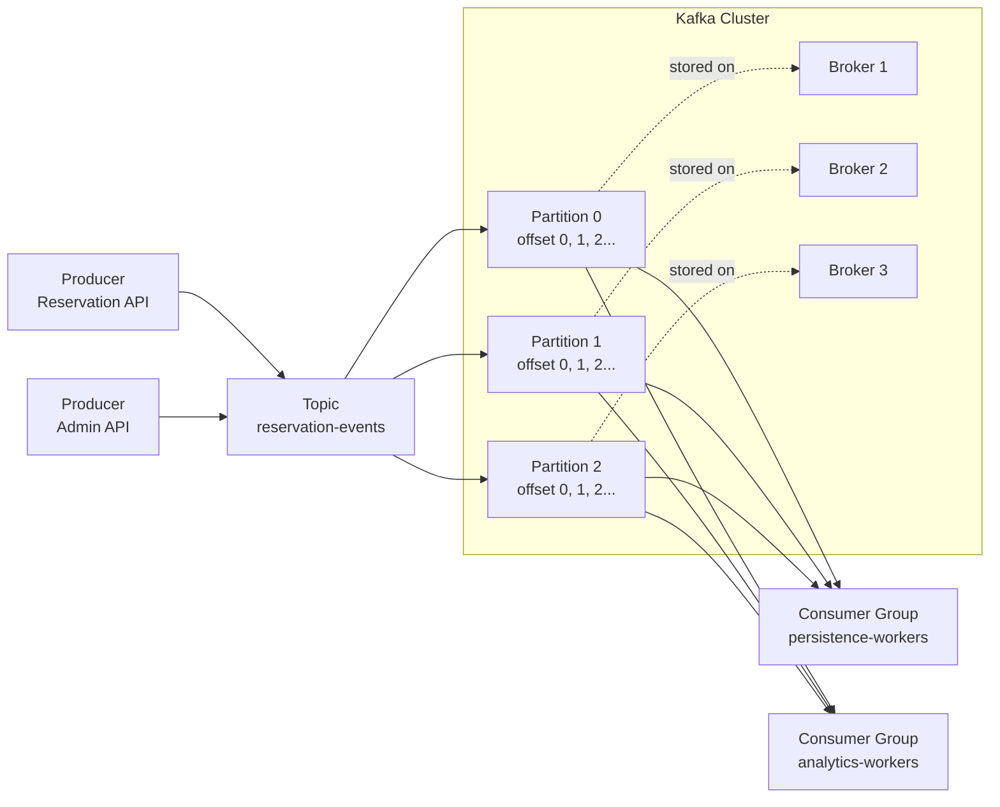
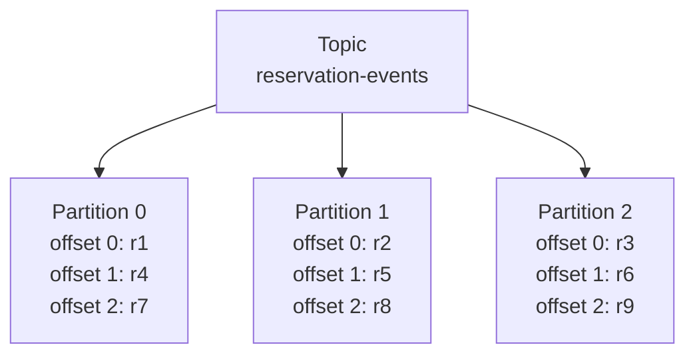
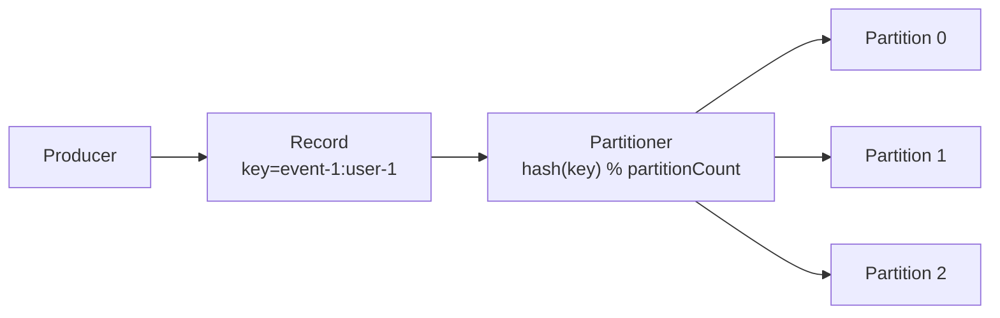
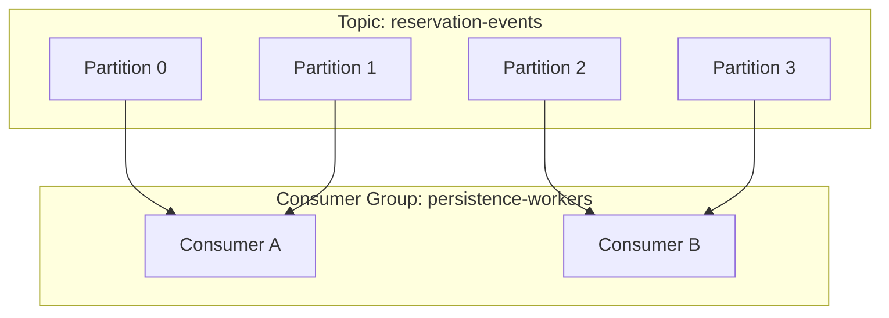
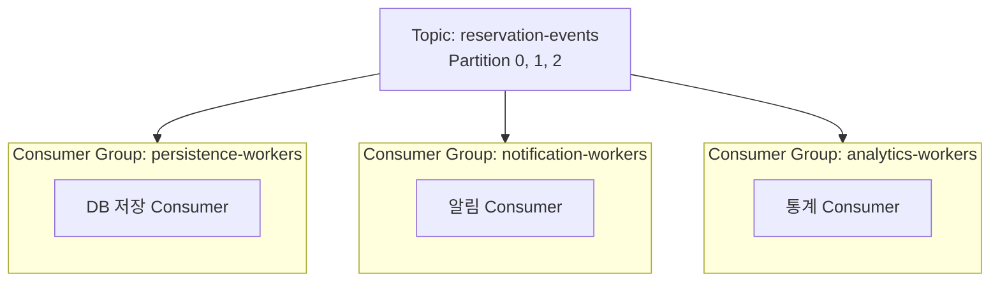
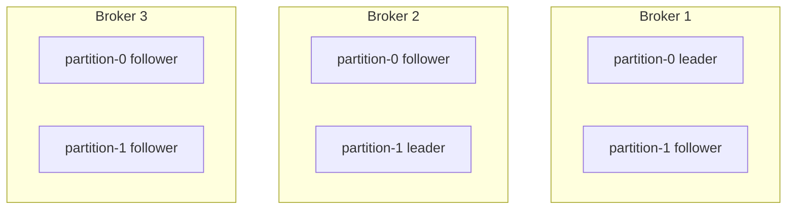
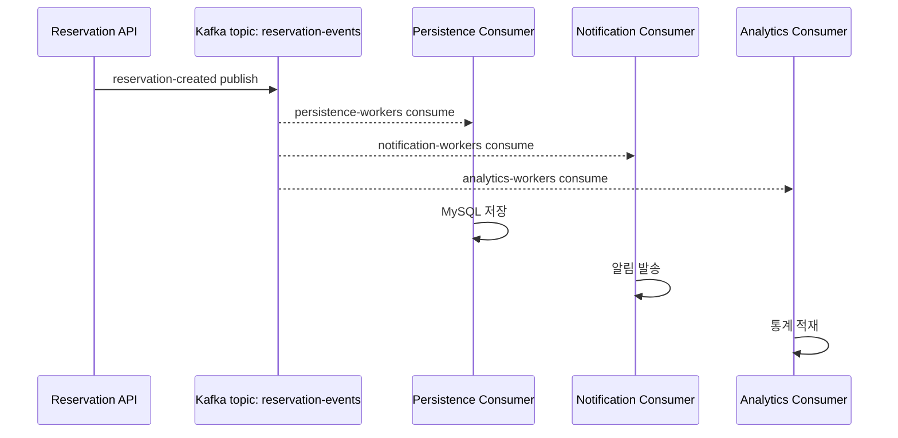
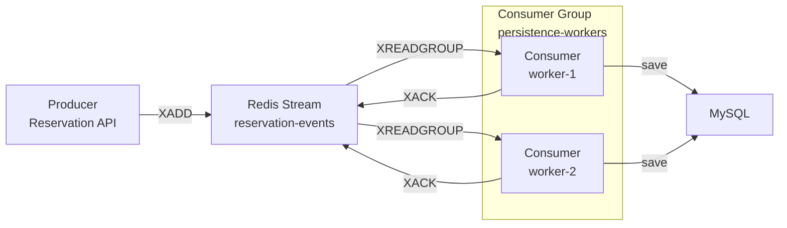
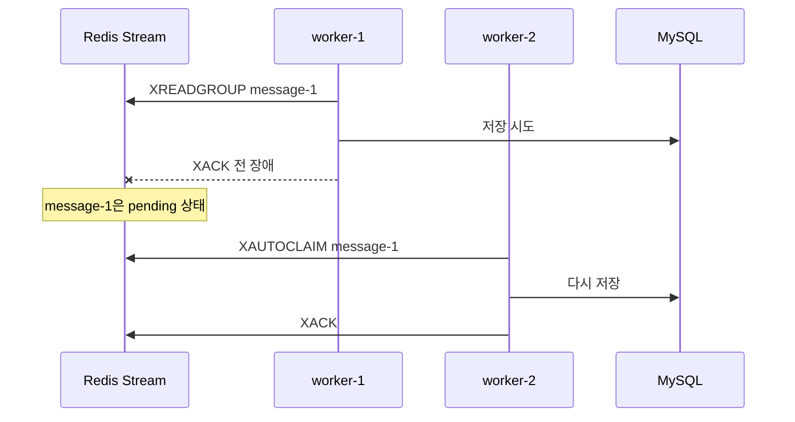
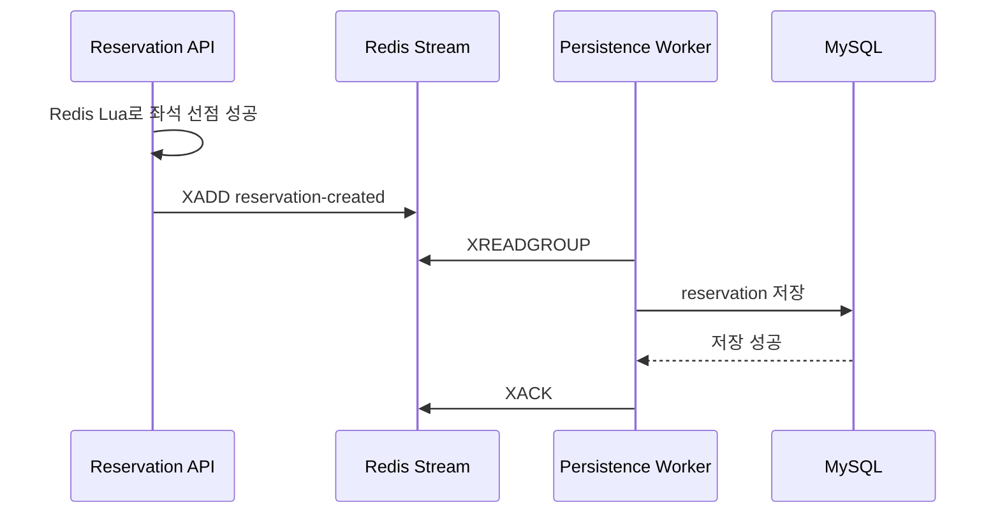

# Kafka와 Redis Streams 비교

## 배경

이 프로젝트는 명절 기차표 예매처럼 짧은 시간에 많은 사용자가 몰리는 상황을 가정한다. 대기열 진입, active admission, 좌석 선점은 Redis를 중심으로 처리하고, 좌석 선점에 성공한 결과는 비동기로 MySQL에 저장한다.

처음에는 Kafka 도입을 고려할 수 있다. Redis가 대기열, active admission, 좌석 선점, 비동기 이벤트 큐까지 모두 담당하면 Redis가 시스템의 단일 장애 지점이 될 수 있기 때문이다. 특히 Redis 장애가 곧 대기열 중단, 좌석 선점 중단, 비동기 저장 이벤트 적체 또는 유실 위험으로 이어진다면 메시지 브로커를 별도 계층으로 분리하고 싶은 판단은 자연스럽다.

그럼에도 현재 구현에서는 Redis Streams를 사용한다. 이유는 Kafka가 부적합해서가 아니라, 현재 프로젝트의 검증 목표가 "분산 이벤트 플랫폼 운영"이 아니라 "Redis에서 원자적으로 선점한 예매 결과를 MySQL에 비동기로 빠짐없이 저장할 수 있는가"에 더 가깝기 때문이다.

## Kafka 기본 개념

Kafka는 분산 로그 기반 메시징 플랫폼이다. Producer가 topic에 record를 append하고, topic은 여러 partition으로 나뉜다. Consumer는 consumer group 단위로 partition을 나누어 읽고, 어디까지 읽었는지는 offset으로 관리한다.

Kafka는 일반적인 큐처럼 메시지를 소비하면 즉시 제거하는 모델이 아니다. 메시지는 append-only log에 남고, consumer가 자신의 offset을 이동시키며 읽는다. 이 구조 덕분에 여러 consumer group이 같은 topic을 서로 독립적으로 소비할 수 있고, retention 기간 안에서는 과거 이벤트를 다시 읽어 replay할 수 있다.

Kafka를 처음 이해할 때 가장 중요한 문장은 다음이다.

> Kafka는 메시지를 꺼내면 사라지는 큐라기보다, 여러 broker에 분산 저장되는 append-only commit log다.

전체 구조를 단순화하면 다음과 같다.



핵심 구성 요소:

- **Broker**: Kafka 서버 노드다. 여러 broker가 cluster를 구성한다.
- **Topic**: 메시지의 논리적 분류 단위다.
- **Partition**: topic을 나눈 물리적 로그 단위다. Kafka 처리량과 병렬성의 핵심이다.
- **Producer**: topic에 record를 쓰는 주체다.
- **Consumer**: topic에서 record를 읽는 주체다.
- **Consumer Group**: 여러 consumer가 하나의 작업 집합처럼 동작하게 하는 단위다.
- **Offset**: consumer가 partition에서 어디까지 읽었는지 나타내는 위치다.
- **Replication**: partition 복제본을 여러 broker에 두어 broker 장애에 대비하는 방식이다.

### Broker

Broker는 Kafka 서버 노드다. Kafka는 보통 broker 여러 대를 묶어 cluster로 운영한다.

```text
Kafka Cluster
├── broker-1
├── broker-2
└── broker-3
```

각 broker는 topic의 partition 일부를 저장한다. 모든 broker가 모든 데이터를 같은 방식으로 들고 있는 것이 아니라, partition 단위로 leader와 replica를 나누어 가진다.

예를 들어 `reservation-events` topic에 partition이 3개 있다면 다음처럼 배치될 수 있다.

```text
broker-1: reservation-events partition-0 leader
broker-2: reservation-events partition-1 leader
broker-3: reservation-events partition-2 leader
```

Kafka client는 cluster에 접속하지만, 실제 record 쓰기와 읽기는 특정 partition의 leader broker를 통해 이루어진다. 그래서 broker는 단순한 네트워크 엔드포인트가 아니라, partition 데이터를 저장하고 복제하고 client 요청을 처리하는 Kafka의 실행 단위다.

### Topic

Topic은 메시지를 논리적으로 분류하는 이름이다. 예매 시스템이라면 다음과 같은 topic을 생각할 수 있다.

```text
reservation-events
payment-events
notification-events
queue-events
```

Producer는 특정 topic에 record를 쓴다.

```text
예약 성공 -> reservation-events topic에 publish
결제 성공 -> payment-events topic에 publish
알림 요청 -> notification-events topic에 publish
```

중요한 점은 topic 자체가 하나의 물리 파일 하나가 아니라는 것이다. topic은 내부적으로 여러 partition으로 쪼개진다. 즉, topic은 논리적인 이름이고, 실제 저장과 병렬 처리의 단위는 partition이다.

### Partition

Partition은 topic을 나눈 물리적 append-only log다. Kafka에서 가장 중요한 개념이다.



각 partition은 독립적인 log다.

```text
partition-0: [offset 0] [offset 1] [offset 2] [offset 3]
partition-1: [offset 0] [offset 1] [offset 2] [offset 3]
partition-2: [offset 0] [offset 1] [offset 2] [offset 3]
```

Offset은 partition 안에서만 의미가 있다. `partition-0 offset 3`과 `partition-1 offset 3`은 서로 다른 메시지다.

Partition은 Kafka에서 다음 세 가지 의미를 가진다.

- **병렬 처리 단위**: partition이 여러 개면 여러 consumer가 나누어 읽을 수 있다.
- **순서 보장 단위**: Kafka는 topic 전체 순서를 보장하지 않고 partition 내부 순서만 보장한다.
- **확장 단위**: 처리량을 늘리고 싶을 때 partition 수와 consumer 수를 함께 고려한다.

예를 들어 예약 이벤트에서 같은 사용자의 이벤트 순서를 지키고 싶다면 `userId` 또는 `eventId:userId`를 record key로 사용할 수 있다.

```text
key=user-1 -> partition-0
key=user-2 -> partition-2
key=user-1 -> partition-0
```

같은 key는 일반적으로 같은 partition으로 들어가므로, 같은 사용자 기준 이벤트 순서를 유지할 수 있다. 반대로 key 없이 round-robin으로 보내면 처리량 분산은 쉬워지지만 특정 사용자나 특정 좌석 기준 순서를 보장하기 어렵다.

### Producer

Producer는 Kafka에 record를 쓰는 주체다. 이 프로젝트에 Kafka를 적용한다면 `Reservation API` 또는 별도 event publisher가 producer가 된다.

```text
ReservationService
-> reservation-events topic에 "user-1이 seat-10 예약 성공" record 전송
```

Producer가 보내는 record는 대략 다음 요소를 가진다.

```text
topic: reservation-events
key: event-1:user-1
value: { eventId, userId, seatId, reservedAt }
headers: optional metadata
```

여기서 key는 중요하다. Kafka producer는 key를 기준으로 어느 partition에 record를 보낼지 결정한다.



Producer가 record를 보낼 때 offset을 직접 정하지 않는다. Broker가 해당 partition log의 끝에 record를 append하면서 offset을 부여한다.

```text
Producer sends:
key=event-1:user-1
value=reservation-created

Broker appends:
topic=reservation-events
partition=0
offset=153
```

### Record

Kafka에서 메시지는 보통 record라고 부른다. record는 단순한 문자열 하나가 아니라 key, value, timestamp, headers 같은 메타데이터를 포함한다.

```text
Record
├── topic
├── partition
├── offset
├── key
├── value
├── timestamp
└── headers
```

예매 성공 이벤트라면 value에는 비즈니스 데이터가 들어간다.

```json
{
  "eventId": "event-1",
  "userId": "user-1",
  "seatId": "seat-10",
  "reservedAt": "2026-05-12T10:15:30Z"
}
```

Key는 partitioning과 순서 보장의 기준이고, value는 consumer가 실제로 처리할 payload다. Headers는 trace id, schema version, event type 같은 부가 정보를 담을 때 쓴다.

### Consumer

Consumer는 topic에서 record를 읽는 주체다. 예매 시스템에서는 MySQL 저장 worker, 알림 worker, 통계 worker 등이 consumer가 될 수 있다.

```text
reservation-events topic
-> ReservationPersistenceConsumer
-> MySQL reservations table 저장
```

Consumer는 메시지를 읽는다고 Kafka에서 메시지를 삭제하지 않는다. 대신 partition log에서 record를 읽고, 처리한 뒤 consumer group의 offset을 commit한다.

```text
partition-0 offset 0 읽음
partition-0 offset 1 읽음
partition-0 offset 2 읽음
commit offset 3
```

여기서 `commit offset 3`은 "offset 3까지 처리했다"가 아니라, 보통 "다음에 읽을 위치가 offset 3이다"라는 의미로 이해하는 편이 안전하다.

```text
읽은 마지막 메시지: offset 2
commit된 offset: 3
다음에 읽을 메시지: offset 3
```

DB 저장과 offset commit 순서는 장애 시나리오와 직접 연결된다.

- DB 저장 후 offset commit 전에 consumer가 죽으면 같은 메시지를 다시 읽을 수 있다.
- Offset commit 후 DB 저장 전에 consumer가 죽으면 메시지를 잃은 것처럼 보일 수 있다.

그래서 Kafka를 써도 DB write는 idempotent해야 한다. 이 프로젝트에서 MySQL에 `event_id + user_id`, `event_id + seat_id` unique constraint를 두는 이유도 같은 맥락이다.

### Consumer Group

Consumer Group은 여러 consumer를 하나의 작업 집합으로 묶는 단위다. 같은 group 안에서는 partition이 consumer들에게 분배된다.



중요한 규칙은 다음이다.

> 하나의 partition은 같은 consumer group 안에서 동시에 하나의 consumer에게만 할당된다.

그래서 partition 4개, consumer 2개라면 보통 각 consumer가 partition 2개씩 맡는다. partition 4개, consumer 4개라면 하나씩 맡을 수 있다. partition 4개, consumer 6개라면 4명만 partition을 받고 2명은 대기한다.

즉, 같은 consumer group에서 처리 병렬성의 최대치는 partition 수에 의해 제한된다.

다른 consumer group은 같은 topic을 독립적으로 읽을 수 있다.



이 구조 덕분에 예약 이벤트 하나를 발행해도 DB 저장, 알림, 통계가 서로의 처리 속도와 offset에 영향을 주지 않고 독립적으로 소비할 수 있다.

### Offset

Offset은 partition 안에서 record의 위치다.

```text
reservation-events partition-0

offset 0: user-1 seat-1 reserved
offset 1: user-2 seat-9 reserved
offset 2: user-3 seat-4 reserved
offset 3: user-4 seat-2 reserved
```

Consumer group은 partition별로 offset을 관리한다.

```text
persistence-workers:
  partition-0 committed offset = 3

analytics-workers:
  partition-0 committed offset = 1
```

이 말은 `persistence-workers`는 offset 0, 1, 2까지 처리했고 다음에 offset 3을 읽을 차례라는 뜻이다. `analytics-workers`는 offset 0까지만 처리했고 다음에 offset 1을 읽을 차례다.

같은 topic이어도 consumer group마다 진행 속도가 다를 수 있다. 이 차이가 consumer lag이다.

```text
latest offset = 1000
consumer committed offset = 700
lag = 300
```

Consumer lag이 계속 증가하면 producer가 쓰는 속도보다 consumer가 처리하는 속도가 느리다는 뜻이다. 운영에서 Kafka를 볼 때 consumer lag은 매우 중요한 지표다.

### Replication

Replication은 partition 복제본을 여러 broker에 두는 방식이다. Kafka는 partition별로 leader와 follower를 둔다.



Producer와 consumer는 일반적으로 leader partition과 통신한다. Follower는 leader 데이터를 복제한다. Leader broker가 죽으면 follower 중 하나가 새 leader가 되어 처리를 이어간다.

예를 들어 replication factor가 3이면 다음과 같이 이해할 수 있다.

```text
partition-0
leader: broker-1
followers: broker-2, broker-3
replication factor: 3
```

이 구조 덕분에 broker 한 대가 죽어도 partition 복제본이 살아 있다면 Kafka cluster는 계속 동작할 수 있다. 단, replication factor를 높인다고 모든 문제가 자동으로 사라지는 것은 아니다. Producer의 `acks` 설정, min in-sync replicas, leader election 정책에 따라 장애 시 데이터 유실 가능성과 쓰기 가용성이 달라진다.

### Retention과 Replay

Kafka record는 consumer가 읽었다고 즉시 삭제되지 않는다. Topic의 retention 정책에 따라 일정 시간 또는 일정 용량만큼 보관된다.

```text
retention.ms = 7 days
retention.bytes = 100GB
```

이 구조 덕분에 replay가 가능하다.

```text
알림 서비스에 버그가 있었다
-> notification-workers offset을 과거로 되돌림
-> reservation-events를 다시 읽어서 알림 재처리
```

이 점이 전통적인 queue와 Kafka의 큰 차이다.

```text
전통적인 queue:
메시지 1개 -> consumer가 가져감 -> queue에서 사라짐

Kafka:
메시지 1개 -> log에 append됨 -> 여러 group이 각자 읽음 -> retention 동안 남음
```

### 예매 시스템에 대입한 흐름

Kafka를 예매 시스템에 넣으면 다음처럼 볼 수 있다.



이벤트 하나가 여러 기능으로 퍼질수록 Kafka의 장점이 커진다. 반대로 "예약 성공 이벤트를 MySQL에 비동기로 저장한다" 정도의 단일 목적이면 Kafka의 운영 복잡도가 현재 문제보다 커질 수 있다.

Kafka가 강한 지점:

- 메시지 브로커 자체를 Redis와 분리할 수 있어 Redis 의존도를 줄일 수 있다.
- broker cluster와 replication을 통해 메시징 계층의 장애 내성을 높일 수 있다.
- partition을 기준으로 높은 처리량과 수평 확장을 만들 수 있다.
- 여러 서비스가 같은 이벤트를 각자 독립적으로 소비하기 좋다.
- retention 기간 안에서 이벤트 replay가 가능하다.
- 결제, 알림, 통계, 추천, 로그 분석처럼 하나의 이벤트가 여러 downstream으로 퍼지는 구조에 강하다.

Kafka의 비용:

- broker cluster, topic, partition, replication, retention, offset, consumer lag을 이해하고 운영해야 한다.
- 로컬 개발 환경과 테스트 환경이 Redis 단독 구성보다 무거워진다.
- partition key 설계가 중요하다. key를 잘못 잡으면 순서 보장이나 부하 분산이 깨진다.
- exactly-once처럼 보이는 처리는 Kafka 안에서만 끝나지 않는다. DB 저장까지 포함하면 idempotency와 unique constraint가 여전히 필요하다.
- 단일 애플리케이션의 작은 비동기 저장 큐에는 운영 표면이 과할 수 있다.

## Redis Streams 기본 개념

Redis Streams는 Redis에 내장된 append-only stream 자료구조다. Producer는 `XADD`로 stream에 메시지를 추가하고, consumer는 `XREAD` 또는 `XREADGROUP`으로 메시지를 읽는다.

Consumer Group을 사용하면 여러 worker가 하나의 stream을 나누어 처리할 수 있다. worker가 메시지를 읽은 뒤 처리를 완료하면 `XACK`를 보낸다. 읽었지만 아직 `XACK`되지 않은 메시지는 Pending Entries List에 남는다.

워커가 메시지를 읽고 죽으면 메시지가 사라지는 것이 아니라 pending 상태로 남는다. 이후 `XPENDING`으로 확인하고, `XAUTOCLAIM` 또는 `XCLAIM`으로 다른 worker가 재소유해 다시 처리할 수 있다. 이 특성 때문에 Redis List의 `LPUSH`/`BRPOP`보다 비동기 저장 큐로 쓰기에 안전하다.

Redis Streams를 처음 이해할 때 가장 중요한 문장은 다음이다.

> Redis Streams는 Redis 안에서 append-only 이벤트 로그와 consumer group 기반 작업 분배를 제공하는 자료구조다.

전체 구조를 단순화하면 다음과 같다.



핵심 구성 요소:

- **Stream**: 메시지가 append되는 Redis 자료구조다.
- **Entry ID**: stream 메시지의 ID다. 보통 시간 기반 ID를 사용한다.
- **Producer**: `XADD`로 메시지를 쓰는 주체다.
- **Consumer Group**: 여러 consumer가 stream을 나누어 읽는 단위다.
- **Consumer**: group 안에서 메시지를 처리하는 worker다.
- **Pending Entries List**: 읽혔지만 아직 ACK되지 않은 메시지 목록이다.
- **XACK**: 처리가 완료되었음을 Redis에 알리는 명령이다.
- **XAUTOCLAIM**: 오래 pending 상태인 메시지를 다른 consumer가 가져오는 명령이다.

### Stream

Stream은 메시지가 append되는 Redis 자료구조다. 이 프로젝트에서는 예매 성공 이벤트를 담는 stream key로 `reservation-events`를 사용한다.

```text
reservation-events
├── 1715500000000-0: { eventId=event-1, userId=user-1, seatId=seat-10 }
├── 1715500000100-0: { eventId=event-1, userId=user-2, seatId=seat-11 }
└── 1715500000200-0: { eventId=event-1, userId=user-3, seatId=seat-12 }
```

Redis List와 다른 점은 "읽기"와 "삭제"가 분리되어 있다는 것이다. List는 `BRPOP`처럼 pop 계열 명령을 쓰면 메시지가 자료구조에서 제거된다. 반면 Stream은 consumer가 읽어도 entry가 바로 사라지지 않는다. 처리 완료 여부는 consumer group의 pending/ack 상태로 관리된다.

### XADD와 Producer

Producer는 `XADD`로 stream에 메시지를 추가한다. 예매 시스템에서는 좌석 선점에 성공한 `Reservation API` 또는 `ReservationEventPublisher`가 producer 역할을 한다.

```redis
XADD reservation-events * eventId event-1 userId user-1 seatId seat-10
```

여기서 `*`는 Redis가 자동으로 entry id를 만들라는 뜻이다. 결과로 다음과 같은 ID가 만들어진다.

```text
1715500000000-0
```

이 ID는 대략 `millisecondsTime-sequence` 형태다.

```text
1715500000000-0
1715500000000-1
1715500000001-0
```

같은 millisecond에 여러 메시지가 들어오면 뒤 sequence가 증가한다. Kafka의 offset이 partition 안에서 증가하는 정수라면, Redis Stream의 Entry ID는 stream 안에서 메시지 위치를 나타내는 시간 기반 ID에 가깝다.

### Entry ID

Entry ID는 stream 메시지의 고유 위치다.

```text
Kafka:
partition-0 offset 0
partition-0 offset 1
partition-0 offset 2

Redis Streams:
1715500000000-0
1715500000001-0
1715500000002-0
```

Consumer는 이 ID를 기준으로 어디부터 읽을지 지정할 수 있다. Consumer group을 쓸 때도 pending 메시지 조회, reclaim, ack 대상 지정에 entry id가 사용된다.

### XREAD

`XREAD`는 stream에서 메시지를 읽는 기본 명령이다.

```redis
XREAD STREAMS reservation-events 0
```

이 명령은 `reservation-events` stream을 처음부터 읽겠다는 뜻이다. 새 메시지를 기다리며 읽을 수도 있다.

```redis
XREAD BLOCK 5000 STREAMS reservation-events $
```

여기서 `$`는 "현재 시점 이후에 들어오는 새 메시지부터 읽겠다"는 뜻이다. 단순 `XREAD`는 여러 worker가 협력해서 메시지를 나눠 처리하고 ACK 상태를 관리하기에는 부족하다. 그래서 비동기 작업 큐처럼 사용할 때는 보통 Consumer Group과 `XREADGROUP`을 사용한다.

### Consumer Group

Consumer Group은 여러 consumer가 하나의 stream을 나눠 읽게 하는 기능이다.

```text
Stream: reservation-events
Consumer Group: persistence-workers
Consumers:
- worker-1
- worker-2
```

Kafka consumer group과 비슷하게 여러 worker가 같은 작업을 분담할 수 있다. 다만 Redis Streams는 Kafka처럼 partition이 있는 구조가 아니다. 하나의 stream에서 group 기준으로 아직 전달되지 않은 메시지를 consumer들에게 나누어 전달한다.

Consumer Group은 `XGROUP CREATE`로 만든다.

```redis
XGROUP CREATE reservation-events persistence-workers 0 MKSTREAM
```

의미는 다음과 같다.

```text
reservation-events stream에
persistence-workers group을 만들고
0부터 읽을 수 있게 한다.
stream이 없으면 MKSTREAM으로 생성한다.
```

`0` 대신 `$`를 쓰면 group 생성 이후 새로 들어오는 메시지부터 읽는다.

```redis
XGROUP CREATE reservation-events persistence-workers $ MKSTREAM
```

### XREADGROUP과 Consumer

Consumer Group으로 메시지를 읽을 때는 `XREADGROUP`을 사용한다.

```redis
XREADGROUP GROUP persistence-workers worker-1 COUNT 10 STREAMS reservation-events >
```

의미는 다음과 같다.

```text
persistence-workers group의 worker-1 consumer로
reservation-events stream에서
아직 group에 전달되지 않은 새 메시지를
최대 10개 읽는다.
```

여기서 `>`가 중요하다.

```text
> = 이 group에 아직 전달되지 않은 새 메시지
```

Worker가 이 명령으로 메시지를 읽으면 Redis는 해당 메시지를 "worker-1에게 전달했지만 아직 ACK되지 않음" 상태로 기록한다. 이 상태가 Pending Entries List에 들어간다.

### Pending Entries List

Pending Entries List, 줄여서 PEL은 Redis Streams Consumer Group에서 가장 중요한 개념 중 하나다. Consumer가 `XREADGROUP`으로 메시지를 읽었지만 아직 `XACK`하지 않으면, 그 메시지는 pending 상태로 남는다.

```text
reservation-events
Consumer Group: persistence-workers

Pending:
- message 1715500000000-0 -> worker-1
- message 1715500000100-0 -> worker-1
```

PEL이 중요한 이유는 worker 장애 때문이다.

```text
worker-1이 메시지를 읽음
-> MySQL 저장하기 전에 죽음
-> XACK 못 함
-> 메시지는 pending 상태로 남음
```

이 경우 메시지가 사라지지 않는다. 다른 worker가 pending 메시지를 다시 가져와 처리할 수 있다. 이 점 때문에 Redis Streams는 단순 Redis List보다 비동기 저장 큐로 쓰기 안전하다.

### XACK

`XACK`는 메시지 처리가 끝났다고 Redis에 알려주는 명령이다.

```redis
XACK reservation-events persistence-workers 1715500000000-0
```

예매 시스템에서는 보통 다음 순서가 안전하다.

```text
1. XREADGROUP으로 메시지 읽음
2. MySQL에 reservation 저장
3. 저장 성공
4. XACK
```

ACK는 외부 처리가 성공한 뒤 보내야 한다. `XACK`를 먼저 하고 DB 저장 전에 worker가 죽으면 Redis 입장에서는 이미 처리 완료된 메시지이므로 재처리되지 않는다.

```text
나쁜 순서:
XACK 먼저 함
-> DB 저장 전에 worker 죽음
-> Redis는 처리 완료로 판단
-> 메시지를 잃은 것처럼 보일 수 있음
```

반대로 DB 저장 후 `XACK` 전에 worker가 죽으면 같은 메시지가 다시 처리될 수 있다. 그래서 Redis Streams를 사용할 때도 DB 저장은 idempotent해야 한다.

### XPENDING

`XPENDING`은 consumer group에 pending 메시지가 얼마나 있는지 확인하는 명령이다.

```redis
XPENDING reservation-events persistence-workers
```

결과로 pending 개수, 가장 오래된 pending id, 가장 최신 pending id, consumer별 pending 개수 등을 볼 수 있다. 특정 범위를 자세히 볼 수도 있다.

```redis
XPENDING reservation-events persistence-workers - + 10
```

운영 관점에서 pending이 계속 쌓인다면 다음 가능성을 의심해야 한다.

- worker가 처리 속도를 따라가지 못한다.
- worker가 죽었다.
- MySQL 저장이 느리다.
- 저장은 성공했지만 `XACK` 로직에 문제가 있다.
- 특정 메시지가 계속 실패해서 pending/retry를 반복한다.

### XAUTOCLAIM

`XAUTOCLAIM`은 오래 pending 상태인 메시지를 다른 consumer가 가져오는 명령이다.

```redis
XAUTOCLAIM reservation-events persistence-workers worker-2 30000 0-0 COUNT 10
```

의미는 다음과 같다.

```text
persistence-workers group에서
30초 이상 pending 상태인 메시지를
worker-2가 다시 가져온다.
```

장애 흐름으로 보면 다음과 같다.



이 기능 덕분에 worker가 죽어도 pending 메시지를 회수해 재처리할 수 있다.

### At-least-once 처리 모델

Redis Streams Consumer Group은 보통 at-least-once 처리 모델로 사용한다.

```text
메시지가 최소 한 번은 처리되도록 한다.
대신 장애나 재시도 상황에서는 같은 메시지가 두 번 처리될 수 있다.
```

예를 들어 다음 시나리오가 가능하다.

```text
worker-1이 메시지를 읽음
-> MySQL 저장 성공
-> XACK 전에 worker-1 죽음
-> 메시지는 pending으로 남음
-> worker-2가 다시 처리
-> MySQL에 같은 reservation을 또 저장하려고 함
```

그래서 Redis Streams를 써도 DB 쪽 idempotency가 필요하다. 이 프로젝트에서는 다음 unique constraint가 중요하다.

```text
UNIQUE(event_id, user_id)
UNIQUE(event_id, seat_id)
```

같은 이벤트가 두 번 처리되어도 DB에서 중복 저장을 막고, worker는 "이미 저장됨"으로 판단한 뒤 `XACK`할 수 있어야 한다.

### Redis List와 비교

Redis List를 큐처럼 쓰면 보통 `LPUSH`/`BRPOP` 조합을 생각한다.

```text
Producer -> LPUSH queue message
Consumer -> BRPOP queue
```

문제는 consumer가 pop한 뒤 처리 전에 죽는 경우다.

```text
consumer가 BRPOP으로 메시지를 가져감
-> List에서는 메시지가 제거됨
-> DB 저장 전에 consumer 죽음
-> 메시지 유실
```

Redis Streams는 이 문제를 pending/ack 모델로 완화한다.

```text
consumer가 XREADGROUP으로 메시지를 읽음
-> stream entry는 남아 있음
-> pending 상태로 기록됨
-> DB 저장 후 XACK
-> 장애 시 XAUTOCLAIM으로 재처리
```

그래서 단순한 best-effort queue가 아니라, worker 장애 후 재처리까지 고려해야 한다면 Redis Streams가 Redis List보다 적합하다.

### 예매 시스템에 대입한 흐름

현재 프로젝트에서 Redis Streams는 다음 흐름을 담당한다.



즉 Redis Streams는 좌석 선점 자체를 담당하지 않는다. 좌석 선점은 Redis Lua Script가 담당하고, Redis Streams는 "성공한 선점 결과를 MySQL에 비동기로 저장하기 위한 이벤트 전달 계층"이다.

Redis Streams가 강한 지점:

- 기존 Redis 인프라를 그대로 사용할 수 있다.
- `XADD`, `XREADGROUP`, `XACK`, `XPENDING`, `XAUTOCLAIM`으로 at-least-once 처리 흐름을 구현할 수 있다.
- Redis CLI로 `XLEN`, consumer group, pending 상태를 바로 관찰할 수 있다.
- Spring Boot 단일 애플리케이션과 소수 worker 구조에서는 구현과 테스트가 단순하다.
- 대기열, active admission, 좌석 선점이 이미 Redis에 있으므로 이벤트 발행 경로가 짧다.

Redis Streams의 비용:

- Redis가 이미 핵심 경로에 있다면 Redis 의존도가 더 커진다.
- Redis 단일 인스턴스 구성에서는 Redis 장애가 곧 stream 장애가 된다.
- Kafka처럼 대규모 장기 보관, replay, multi-service fan-out을 기본 목표로 한 플랫폼은 아니다.
- stream trimming, Redis memory, RDB/AOF persistence 설정을 신경 써야 한다.
- Redis 자체의 고가용성을 Sentinel, Cluster, managed Redis 등으로 보강하지 않으면 단일 장애 지점 문제가 남는다.

## 단일 장애 지점 관점

Kafka를 처음 고려한 가장 큰 이유는 Redis를 단일 장애 지점으로 만들지 않기 위해서다. 이 관점은 중요하다.

Redis가 다음 책임을 모두 가지면 장애 영향 범위가 넓어진다.

- waiting queue 저장
- active admission token 저장
- 좌석 선점 상태 저장
- idempotency 결과 저장
- 비동기 저장 이벤트 stream 저장

이 구조에서 Redis가 내려가면 예매 시스템의 핵심 기능 대부분이 멈춘다. Kafka를 별도로 두면 적어도 비동기 이벤트 큐 계층은 Redis와 분리된다. 예를 들어 좌석 선점 이후 이벤트를 Kafka에 기록하는 구조라면, Redis 장애와 Kafka 장애를 분리해서 볼 수 있다.

다만 현재 구현에서는 좌석 선점 자체가 Redis Lua Script에 강하게 의존한다. 즉 Kafka를 도입해도 Redis 장애 시 좌석 선점 hot path는 여전히 멈춘다. Kafka가 해결하는 것은 "비동기 이벤트 큐의 독립성"이지, Redis 기반 좌석 선점의 장애를 없애는 것은 아니다.

그래서 현재 단계의 판단은 다음과 같다.

- Redis 장애 지점 문제는 실제로 존재한다.
- Kafka는 이벤트 큐 계층을 Redis에서 분리하는 좋은 선택지다.
- 하지만 이 프로젝트의 현재 병목과 검증 대상은 Kafka 운영이 아니라 Redis 좌석 선점과 MySQL 저장 정합성이다.
- Kafka를 넣어도 Redis Lua 기반 좌석 선점 의존성은 사라지지 않는다.
- 따라서 먼저 Redis Streams로 작은 폐루프를 완성하고, 이후 고가용성 요구가 커지면 Kafka 또는 Redis HA 구성을 비교하는 편이 낫다.

## 프로젝트 기준 비교

| 항목 | Kafka | Redis Streams |
|---|---|---|
| 기본 성격 | 분산 로그 기반 메시징 플랫폼 | Redis 내장 stream 자료구조 |
| 운영 단위 | 별도 Kafka cluster | 기존 Redis |
| 장애 격리 | Redis와 메시징 계층 분리 가능 | Redis 의존도 증가 |
| 수평 확장 | partition 기반 확장에 강함 | Redis 구성과 stream 처리 방식에 의존 |
| 재처리 | offset reset과 retention 기반 replay에 강함 | pending reclaim 기반 재처리에 적합 |
| fan-out | 여러 consumer group이 독립 소비하기 좋음 | 가능하지만 Kafka 생태계만큼 강하지 않음 |
| 장기 보관 | retention 정책으로 장기 replay 가능 | memory/trimming/persistence 정책에 민감 |
| 로컬 재현성 | 구성 요소가 늘어남 | Redis + MySQL로 단순 |
| 학습/문서 초점 | Kafka 운영과 이벤트 플랫폼 설계까지 포함 | Redis 선점 결과의 비동기 저장 정합성에 집중 |
| 현재 프로젝트 적합도 | 다음 확장 단계 후보 | 현재 구현에 적합 |

## 왜 지금은 Redis Streams인가

현재 프로젝트에서 비동기 MQ가 담당하는 일은 크지 않다.

1. 좌석 선점이 Redis Lua Script에서 성공한다.
2. 성공 이벤트를 stream에 남긴다.
3. worker가 consumer group으로 읽는다.
4. MySQL에 저장한다.
5. 저장 성공 시 `XACK`한다.
6. worker 장애로 ACK되지 않은 메시지는 `XAUTOCLAIM`으로 재처리한다.

이 요구사항만 보면 Redis Streams가 제공하는 기능으로 충분하다. 특히 현재 프로젝트는 Redis를 이미 핵심 실험 대상으로 삼고 있다. Redis Sorted Set으로 대기열을 만들고, Redis TTL key로 active admission을 표현하고, Redis Lua Script로 좌석 선점을 원자 처리한다. 여기서 비동기 저장 이벤트까지 Redis Streams로 두면 전체 흐름을 Redis CLI와 통합 테스트로 관찰하기 쉽다.

반대로 Kafka를 넣으면 "왜 Redis Lua Script로 좌석 선점을 하는가"보다 "Kafka topic은 어떻게 나눴는가", "partition key는 무엇인가", "consumer offset commit은 언제 하는가", "broker 장애와 Redis 장애를 어떻게 함께 다루는가"가 더 큰 설명 대상이 된다. 이 질문들은 중요하지만, 현재 단계에서는 프로젝트의 핵심 증명 범위를 넓힌다.

따라서 현재 선택은 다음 문장으로 정리할 수 있다.

> Kafka는 Redis 단일 장애 지점을 줄이고 메시징 계층을 독립시키는 좋은 선택지지만, 현재 프로젝트에서는 Redis 기반 좌석 선점과 MySQL 비동기 저장의 정합성을 먼저 증명하기 위해 Redis Streams를 선택한다.

## 언제 Kafka로 바꾸는가

다음 조건이 생기면 Kafka 도입이 더 설득력 있다.

- reservation 이벤트를 결제, 알림, 통계, 감사 로그 등 여러 독립 서비스가 소비한다.
- 이벤트를 장기간 보관하고 특정 시점부터 replay해야 한다.
- 비동기 저장 큐가 Redis 장애와 분리되어야 한다.
- Redis Streams의 단일 stream/worker 모델로 처리량 한계가 뚜렷해진다.
- 서비스가 여러 개로 분리되어 메시징 계층이 시스템 간 표준 계약이 된다.
- Schema Registry, Kafka Connect, stream processing 같은 Kafka 생태계가 필요하다.

## Redis 단일 장애 지점 완화 방향

Kafka를 바로 도입하지 않더라도 Redis 단일 장애 지점 문제는 별도로 다뤄야 한다.

가능한 완화 방향:

- Redis Sentinel 또는 managed Redis HA로 failover를 구성한다.
- Redis Cluster로 key 분산과 장애 격리를 검토한다.
- Redis persistence 정책을 RDB/AOF 관점에서 명확히 정한다.
- stream key에 trimming 정책을 둬 메모리 증가를 제어한다.
- worker는 at-least-once를 전제로 idempotent하게 작성한다.
- MySQL에는 `event_id + user_id`, `event_id + seat_id` unique constraint를 둔다.
- 장애 실험에서 Redis down, worker down, MySQL down을 분리해서 검증한다.

결론적으로 Kafka와 Redis Streams는 우열 관계라기보다 문제 크기와 운영 목표가 다르다. Kafka는 메시징 계층을 독립적인 분산 플랫폼으로 키우고 싶을 때 강하고, Redis Streams는 이미 Redis 중심으로 동작하는 시스템에서 작고 명확한 비동기 처리 흐름을 만들 때 실용적이다. 이 프로젝트의 현재 단계에서는 Redis Streams가 더 작고 선명한 선택이며, Kafka는 Redis 단일 장애 지점 완화와 서비스 분리 단계에서 다시 꺼내볼 확장 카드다.
