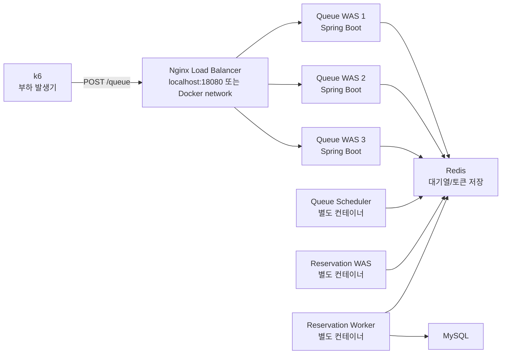

# 대기열 API 로컬 부하 테스트 분석 리포트

## 1. 목적

이 문서는 대기열 진입 API에 대해 로컬 환경에서 수행한 부하 테스트 과정을 정리한다.

단순히 "몇 건 성공했다"를 기록하는 것이 아니라, 실패가 발생했을 때 원인을 어떻게 좁혀 갔고, 어떤 설정을 변경했으며, 최종적으로 어디까지 신뢰 가능한 결론을 낼 수 있는지를 설명한다.

테스트 대상 API는 대기열 진입 요청이다.

```http
POST /api/events/{eventId}/queue
Content-Type: application/json

{
  "userId": "user-1"
}
```

성공 응답의 기준은 HTTP 200과 `queueToken` 반환이다.

## 2. 테스트 대상 아키텍처

로컬 테스트 시점의 실행 구조는 다음과 같다.



중요한 점은 `queue-scheduler`와 `reservation-worker`가 API WAS 안에서 같이 도는 것이 아니라 별도 Docker 컨테이너로 분리되어 있다는 것이다. 같은 Spring Boot 애플리케이션 이미지를 사용하지만 환경변수로 역할을 나눈다.

- `queue-was-1/2/3`: 대기열 API 요청 처리
- `queue-scheduler`: 대기열 사용자를 active user로 전환
- `reservation-was-1`: 예약 API 처리
- `reservation-worker`: Redis Stream 이벤트를 읽어 MySQL에 비동기 반영
- `load-balancer`: Nginx 기반 WAS 라우팅

## 3. 테스트 방식

부하 테스트 도구는 k6를 사용했다. 스크립트는 `constant-arrival-rate` executor를 사용한다.

즉, "동시에 N명이 접속"하는 테스트라기보다 "1초 동안 지정한 rate만큼 요청이 도착하도록 시도"하는 테스트다.

```javascript
executor: 'constant-arrival-rate',
rate,
timeUnit: '1s',
duration,
preAllocatedVUs,
maxVUs
```

각 요청은 서로 다른 `userId`로 대기열 진입을 시도한다. 병렬 부하 발생기를 사용할 때 사용자 ID가 충돌하지 않도록 `USER_PREFIX` 환경변수를 추가했다.

## 4. 1차 테스트: 1만 요청에서도 실패 발생

처음에는 host에서 `localhost:18080`으로 요청을 보냈다.

```text
k6(host)
  -> localhost:18080
  -> Docker Desktop port publishing
  -> Nginx container
  -> Queue WAS 3대
  -> Redis
```

1초에 1만 요청을 목표로 테스트했을 때 다음 문제가 발생했다.

| 항목 | 결과 |
| --- | ---: |
| 요청 수 | 10,053 |
| 성공 수 | 6,856 |
| 실패 수 | 3,197 |
| 실패율 | 31.80% |
| p95 응답 시간 | 4.81s |
| 대표 오류 | `connection reset by peer` |

이 단계에서 중요한 관찰은 Spring Boot 애플리케이션이 죽지 않았다는 점이다. 테스트 이후에도 `/actuator/health`는 200 OK를 반환했고, WAS 로그에서 대량의 애플리케이션 예외도 발견되지 않았다.

따라서 초기 가설은 다음과 같이 나뉘었다.

1. 애플리케이션 처리 로직이 느려서 요청이 밀렸는가?
2. Nginx 기본 connection 설정이 낮아서 앞단에서 막혔는가?
3. Docker Desktop의 host-to-container 포트포워딩 경로가 대량 연결을 감당하지 못했는가?
4. k6 부하 발생기 자체가 1초에 충분한 요청을 만들지 못했는가?

## 5. 원인 탐색 과정

### 5.1 애플리케이션 장애 여부 확인

테스트 직후 다음을 확인했다.

- `docker compose ps`: 모든 주요 컨테이너가 `Up`
- `/actuator/health`: 200 OK
- Queue WAS 로그: 대량의 application exception 없음
- Nginx error log: 명확한 upstream 장애 로그 없음

이 결과만으로 "애플리케이션은 완전히 문제가 없다"고 단정할 수는 없다. 하지만 적어도 프로세스 crash, OOM, Redis 장애, MySQL 장애처럼 명확한 서버 장애는 아니었다.

### 5.2 Nginx 기본값 확인

기본 Nginx 컨테이너는 전역 설정을 따로 주입하지 않으면 일반적으로 낮은 `worker_connections` 값을 사용한다. 기존 설정은 upstream keepalive도 낮았다.

대량의 짧은 요청이 동시에 들어오는 테스트에서는 다음 요소가 병목이 될 수 있다.

- worker process가 동시에 처리 가능한 connection 수
- listen backlog
- upstream keepalive 부족으로 인한 WAS 연결 재생성
- access log I/O
- 컨테이너의 file descriptor 제한

따라서 Nginx와 컨테이너 런타임 설정을 먼저 보강했다.

## 6. 문제 해결을 위한 설정 변경

### 6.1 Docker Compose ulimit 보강

Nginx, WAS, scheduler, worker 컨테이너에 `nofile` 한도를 올렸다.

```yaml
ulimits:
  nofile:
    soft: 1048576
    hard: 1048576
```

대량 connection을 처리하려면 socket도 file descriptor를 사용하므로, 낮은 `nofile` 한도는 곧 connection 한도가 된다.

### 6.2 Nginx 전역 설정 추가

`nginx/nginx.conf`를 추가하고 다음 설정을 적용했다.

```nginx
worker_processes auto;
worker_rlimit_nofile 1048576;

events {
    worker_connections 65535;
    multi_accept on;
}

http {
    access_log off;
    keepalive_timeout 10s;
    keepalive_requests 100000;
}
```

설정 의도는 다음과 같다.

- `worker_connections`: 동시에 처리 가능한 connection 수 확대
- `worker_rlimit_nofile`: nginx worker가 열 수 있는 file descriptor 확대
- `multi_accept`: worker가 한 번에 여러 connection을 accept하도록 설정
- `access_log off`: 부하 테스트 중 디스크/STDOUT 로그 I/O 영향 제거
- `keepalive_requests`: keepalive connection 재사용성 증가

### 6.3 Nginx upstream 설정 보강

```nginx
upstream queue_api {
    least_conn;
    server queue-was-1:8080 max_fails=3 fail_timeout=5s;
    server queue-was-2:8080 max_fails=3 fail_timeout=5s;
    server queue-was-3:8080 max_fails=3 fail_timeout=5s;
    keepalive 2048;
}

server {
    listen 80 backlog=65535 reuseport;
    proxy_http_version 1.1;
    proxy_set_header Connection "";
    proxy_connect_timeout 1s;
    proxy_send_timeout 10s;
    proxy_read_timeout 10s;
    proxy_next_upstream off;
}
```

설정 의도는 다음과 같다.

- `least_conn`: 현재 연결이 적은 WAS로 분산
- `keepalive 2048`: Nginx와 WAS 사이의 연결 재사용 증가
- `backlog=65535`: accept 대기열 확장
- `reuseport`: 여러 worker가 같은 port에서 accept 경쟁 가능
- `proxy_next_upstream off`: 실패를 다른 WAS로 재시도하며 부하를 증폭시키는 상황 방지

설정 반영 후 컨테이너 내부에서 `ulimit -n=1048576`, `nginx -t successful`, `/actuator/health=200`을 확인했다.

## 7. 설정 변경 후 host 경로 재테스트

설정 변경 이후에도 host에서 `localhost:18080`으로 1초 1만 요청을 넣으면 완벽하지 않았다.

| 테스트 | 요청 수 | 성공 수 | 실패율 | p95 | 비고 |
| --- | ---: | ---: | ---: | ---: | --- |
| host -> localhost:18080, 10,000/s 1s | 10,053 | 6,856 | 31.80% | 4.81s | connection reset 다수 |
| host -> localhost:18080, VU 제한 조정 | 5,053 | 4,721 | 6.57% | 1.29s | dropped iteration 4,948 |
| host -> localhost:18080, 30,000/s 1s | 6,659 | 6,041 | 9.28% | 1.53s | dropped iteration 23,325 |

여기서 확인한 사실은 두 가지다.

첫째, VU를 줄이면 latency와 실패율이 개선된다. 이는 WAS 로직 자체가 모든 요청을 느리게 처리해서 터지는 패턴과 다르다.

둘째, 목표 rate를 크게 올리면 k6가 요청을 모두 만들지 못하고 `dropped_iterations`가 증가한다. 이는 부하 발생기와 로컬 네트워크 경계가 함께 병목이 되고 있음을 의미한다.

## 8. Docker Desktop 병목 분석

macOS에서 Docker Desktop은 Linux 컨테이너가 host network를 네이티브로 직접 공유하는 구조가 아니다. 컨테이너는 Docker Desktop 내부 Linux VM 위에서 실행되고, host의 `localhost:18080`으로 들어온 요청은 Docker Desktop의 포트포워딩 계층을 거쳐 컨테이너의 Nginx로 전달된다.

즉 host에서 테스트할 때 실제 경로는 다음과 같다.

```text
k6 process on macOS
  -> macOS loopback socket
  -> Docker Desktop port publishing / forwarding layer
  -> Linux VM network
  -> Nginx container
  -> Spring Boot container
```

이 경로에서는 애플리케이션에 도달하기 전에도 병목이 생길 수 있다.

### 8.1 connection 폭발

1초 동안 1만 또는 3만 요청을 만들면 짧은 시간에 매우 많은 TCP connection 생성, accept, close가 발생한다.

이때 비용은 단순히 HTTP 요청 처리 비용이 아니다.

- client socket 생성
- ephemeral port 할당
- TCP handshake
- Docker Desktop 포트포워딩
- 컨테이너 네트워크 전달
- Nginx accept
- upstream WAS connection 확보
- 응답 후 connection 정리
- TIME_WAIT 누적

특히 `constant-arrival-rate`에서 높은 VU를 잡으면 "1초 동안 많은 사용자가 요청을 보낸다"를 넘어서 "1초 동안 매우 많은 socket을 동시에 열려고 한다"에 가까운 상황이 된다.

### 8.2 ephemeral port와 TIME_WAIT

클라이언트가 서버로 TCP 연결을 만들 때 local ephemeral port를 사용한다. 짧은 시간에 대량 연결을 만들고 닫으면 ephemeral port와 TIME_WAIT 상태가 압박을 받는다.

macOS host에서 Docker Desktop을 경유하는 테스트는 이 영향을 더 크게 받는다. 요청이 애플리케이션까지 도달하기 전에 host와 Docker Desktop 경계에서 connection reset이 발생할 수 있다.

### 8.3 Docker Desktop은 운영 환경의 L4/L7 로드밸런서가 아니다

운영 환경에서는 보통 다음과 같은 구조가 된다.

```text
External clients
  -> Cloud Load Balancer / Nginx / ALB
  -> Kubernetes Node / EC2
  -> Application containers
```

반면 로컬 Docker Desktop은 개발 편의성을 위한 VM 기반 컨테이너 런타임이다. `localhost` 포트 게시 기능은 운영용 L4 로드밸런서와 같은 성능 특성을 보장하지 않는다.

따라서 host에서 `localhost:18080`으로 1초 3만 요청을 넣는 테스트는 "애플리케이션의 한계"보다 "로컬 Docker Desktop ingress 경로의 한계"를 먼저 측정할 가능성이 높다.

## 9. 병목 분리를 위한 Docker network 내부 테스트

host-to-container 포트포워딩 병목을 제거하기 위해 k6 자체를 Docker network 내부에서 실행했다.

```text
k6 container
  -> Docker network
  -> load-balancer:80
  -> Queue WAS 3대
  -> Redis
```

이 테스트는 실제 사용자가 Docker 내부에서 발생한다는 뜻이 아니다. 목적은 명확하다.

> host `localhost` 포트포워딩 경계를 제거했을 때, Nginx + WAS + Redis 경로가 어느 정도까지 정상 처리되는지 분리 측정한다.

### 9.1 1초 1만 요청

| 항목 | 결과 |
| --- | ---: |
| 목표 | 10,000 req/s, 1s |
| 실제 요청 | 9,958 |
| 성공 | 9,958 |
| 실패율 | 0.00% |
| p95 | 1.08s |

이 결과는 중요하다. 같은 Nginx, 같은 Queue WAS 3대, 같은 Redis를 사용했는데, host `localhost` 경로에서는 reset이 발생했고 Docker network 내부에서는 실패율 0%로 통과했다.

따라서 1초 1만 요청 실패의 주된 원인은 애플리케이션 처리 로직이라기보다 host-to-Docker Desktop ingress 경계였다고 판단할 수 있다.

### 9.2 총 3만 명 처리

1초 3만 요청은 로컬 부하 발생기가 먼저 한계에 부딪혔다. 따라서 "총 3만 명 대기열 진입" 검증은 3,000 req/s를 10초 동안 유지하는 방식으로 수행했다.

| 항목 | 결과 |
| --- | ---: |
| 목표 | 3,000 req/s, 10s |
| 실제 요청 | 30,001 |
| 성공 | 30,001 |
| 실패율 | 0.00% |
| p95 | 5.22ms |

이 테스트는 총 3만 명 대기열 진입 처리에 대해 매우 안정적인 결과를 보였다.

## 10. 왜 1초 3만 요청은 로컬에서 불가능했는가

1초 3만 요청을 Docker network 내부에서 시도했을 때도 문제가 발생했다. 하지만 이때의 실패 양상은 애플리케이션 장애가 아니라 k6 부하 발생기 한계였다.

| 테스트 | 결과 |
| --- | --- |
| 단일 k6 컨테이너, 30,000 req/s, 1s, 30,000 VUs | k6 컨테이너가 exit code 137로 종료 |
| k6 컨테이너 3개 분산, 각 10,000 req/s | 일부 k6 컨테이너 exit code 137, latency 증가 |

exit code 137은 일반적으로 프로세스가 SIGKILL된 상황이며, Docker 환경에서는 메모리 한계로 인한 OOM kill일 때 자주 발생한다.

즉 이 결과는 다음을 의미한다.

- "애플리케이션이 3만 요청을 받아서 죽었다"가 아니다.
- "로컬 머신에서 1초 3만 요청을 만들기 위한 부하 발생기 리소스가 부족했다"에 가깝다.
- k6 VU를 낮추면 실패율은 0%로 안정화되지만, 목표 요청 수를 만들지 못해 `dropped_iterations`가 발생한다.

CS 관점에서 보면 1초 3만 요청은 단순한 API 호출 3만 번이 아니다. 매우 짧은 시간에 다음 자원이 동시에 필요하다.

- 부하 발생기 메모리
- 부하 발생기 스케줄링 가능한 VU 수
- TCP connection 생성 능력
- ephemeral port
- Docker network packet forwarding
- Nginx accept 처리
- WAS thread/connection 처리
- Redis command 처리

로컬 Mac + Docker Desktop 환경에서는 이 중 애플리케이션 앞단의 부하 발생기와 네트워크 경계가 먼저 포화되었다.

## 11. 최종 결론

이번 로컬 테스트에서 얻은 결론은 다음과 같다.

### 11.1 초당 1만 요청은 가능하다

Docker network 내부에서 Nginx, Queue WAS 3대, Redis를 거치는 조건으로 1초 1만 요청을 성공시켰다.

```text
10,000 req/s, 1s
실제 요청: 9,958
성공: 9,958
실패율: 0.00%
p95: 1.08s
```

이는 애플리케이션과 Nginx 설정이 1초 1만 대기열 진입 요청을 처리할 수 있음을 보여준다.

### 11.2 총 3만 명 처리는 가능하다

로컬에서 신뢰 가능한 방식으로 3,000 req/s를 10초 유지하여 총 30,001건을 성공 처리했다.

```text
3,000 req/s, 10s
실제 요청: 30,001
성공: 30,001
실패율: 0.00%
p95: 5.22ms
```

이 결과는 "대기열에 총 3만 명이 진입하는 시나리오"를 안정적으로 처리할 수 있음을 보여준다.

### 11.3 초당 3만 요청은 현재 로컬 환경에서 신뢰성 있게 검증할 수 없다

1초 3만 요청은 애플리케이션이 실패하기 전에 다음 요소들이 먼저 병목이 되었다.

- host `localhost` -> Docker Desktop 포트포워딩 경로
- k6 단일 프로세스/컨테이너의 VU 및 메모리 한계
- 짧은 시간 동안 폭증하는 TCP connection 생성 비용

따라서 이 프로젝트의 로컬 테스트 결론은 "초당 3만 요청을 애플리케이션이 못 버틴다"가 아니다.

더 정확한 결론은 다음과 같다.

> 현재 로컬 Docker Desktop 환경에서는 1초 3만 요청을 신뢰성 있게 발생시키고 측정할 수 없다. 해당 수치를 검증하려면 부하 발생기를 여러 물리/가상 머신으로 분산하고, 운영과 유사한 L4/L7 로드밸런서 및 네트워크 환경에서 별도 테스트해야 한다.

## 12. 면접 관점에서 중요한 포인트

이번 테스트에서 의미 있는 점은 최종 숫자보다 병목을 분리한 과정이다.

1. 처음에는 1만 요청에서도 실패했다.
2. 애플리케이션 로그와 health check로 서버 crash가 아님을 확인했다.
3. Nginx와 컨테이너 file descriptor 설정을 보강했다.
4. host `localhost` 경로에서 여전히 reset이 발생함을 확인했다.
5. Docker network 내부 테스트로 host-to-Docker Desktop ingress 병목을 제거했다.
6. 같은 애플리케이션 구성에서 1초 1만 요청이 실패율 0%로 성공함을 확인했다.
7. 1초 3만 요청은 애플리케이션보다 부하 발생기와 로컬 런타임이 먼저 한계에 도달함을 확인했다.
8. 최종적으로 총 3만 명 대기열 진입은 3,000 req/s, 10s 조건에서 실패율 0%로 검증했다.

이 흐름은 부하 테스트에서 가장 중요한 원칙을 따른다.

> 성능 테스트 결과는 숫자 하나로 해석하면 안 된다. 부하 발생기, 네트워크 경로, 로드밸런서, 애플리케이션, 저장소 중 어느 계층이 먼저 포화되는지 분리해서 확인해야 한다.

## 13. 향후 운영 유사 테스트를 위한 제안

1초 3만 요청을 실제로 검증하려면 로컬 Docker Desktop이 아니라 다음 구성이 필요하다.

- k6 부하 발생기를 2대 이상으로 분산
- 각 부하 발생기 인스턴스의 CPU/메모리 모니터링
- AWS ALB 또는 Nginx/Envoy 기반 L7 로드밸런서
- WAS 인스턴스별 CPU, memory, thread, connection pool 지표 수집
- Redis CPU, command latency, connected clients, instantaneous ops/sec 수집
- 네트워크 단의 connection reset, SYN backlog, TIME_WAIT 관찰

그 환경에서 30,000 req/s를 통과했다면 비로소 "초당 3만 요청 처리 가능"이라고 말할 수 있다.

현재 로컬 테스트에서 정직하게 말할 수 있는 검증 완료 범위는 다음과 같다.

- 초당 1만 대기열 진입 요청: 성공
- 총 3만 명 대기열 진입: 성공
- 초당 3만 요청: 로컬 부하 발생/네트워크 한계로 신뢰성 있는 검증 불가
