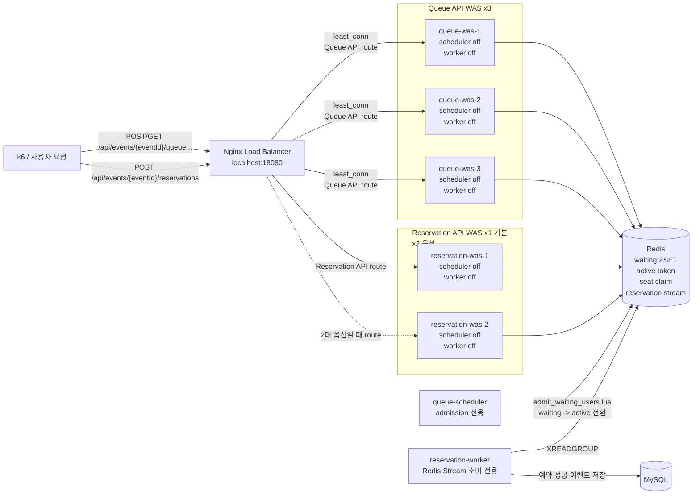

# Local Multi-WAS 실행 구조

로컬 부하 테스트는 단일 Spring Boot 프로세스를 직접 때리는 방식이 아니라, Load Balancer 뒤에 여러 WAS를 둔 구조로 실행할 수 있다.

## 기본 구성



## 왜 API WAS와 Scheduler/Worker를 분리하는가

Spring Boot 애플리케이션은 같은 jar로 실행되지만 역할은 환경 변수로 분리한다.

- `queue-was-*`: HTTP Queue API만 담당한다. `QUEUE_SCHEDULER_ENABLED=false`로 admission scheduler를 끈다.
- `reservation-was-*`: HTTP Reservation API만 담당한다. `RESERVATION_PERSISTENCE_WORKER_ENABLED=false`로 stream worker를 끈다.
- `queue-scheduler`: Redis 대기열에서 초당 설정된 수만 active user로 전환한다.
- `reservation-worker`: Redis Stream의 예약 성공 이벤트를 MySQL에 저장한다.

이렇게 나누지 않으면 WAS를 3대 띄웠을 때 scheduler도 3개가 같이 돌면서 의도한 admission rate보다 더 많은 사용자를 입장시킬 수 있다. worker도 여러 API 인스턴스에서 동시에 돌면 테스트 해석이 어려워진다.

## 실행 명령어

Queue API 3대, Reservation API 1대 구성:

```bash
docker compose up --build -d
```

Queue API 3대, Reservation API 2대 구성:

```bash
docker compose --profile reservation-two \
  -f docker-compose.yml \
  -f docker-compose.reservation-two.yml \
  up --build -d
```

공통 진입점은 Load Balancer다.

```bash
curl http://localhost:18080/actuator/health
```

## 라우팅 기준

Nginx는 API path 기준으로 upstream을 나눈다.

- `/api/events/{eventId}/queue...` → `queue-was-1`, `queue-was-2`, `queue-was-3`
- `/api/events/{eventId}/reservations` → `reservation-was-1`
- 2대 옵션에서는 reservation 요청이 `reservation-was-1`, `reservation-was-2`로 분산된다.

부하 테스트도 애플리케이션 포트가 아니라 Load Balancer 진입점인 `http://localhost:18080`을 대상으로 실행해야 한다.

```bash
BASE_URL=http://localhost:18080 k6 run load-tests/queue-entry-10000-1s.js
```

## 종료

```bash
docker compose down
```

2대 Reservation API 옵션으로 실행했다면 같은 compose 파일 조합으로 종료한다.

```bash
docker compose --profile reservation-two \
  -f docker-compose.yml \
  -f docker-compose.reservation-two.yml \
  down
```
