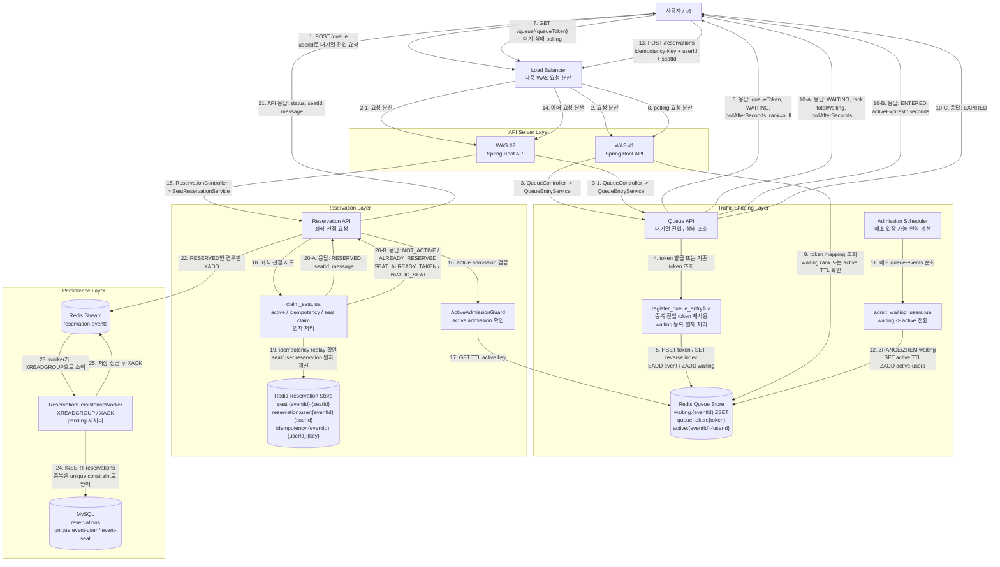
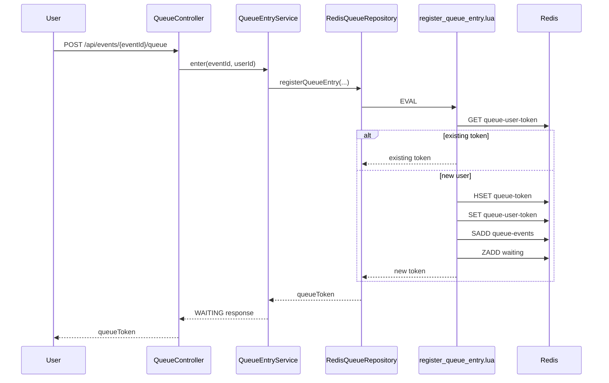
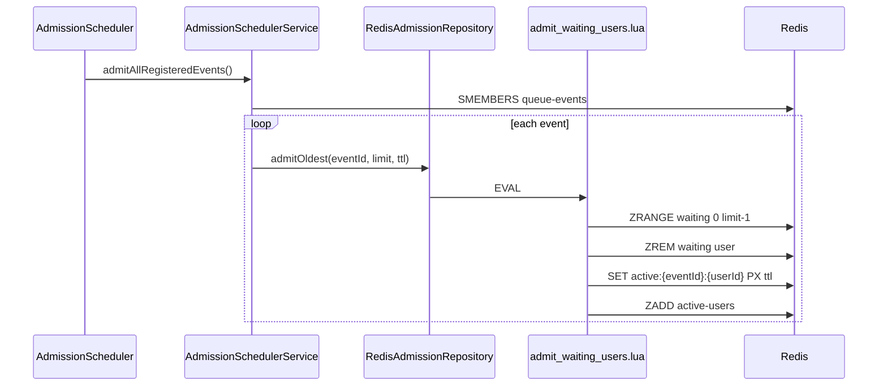
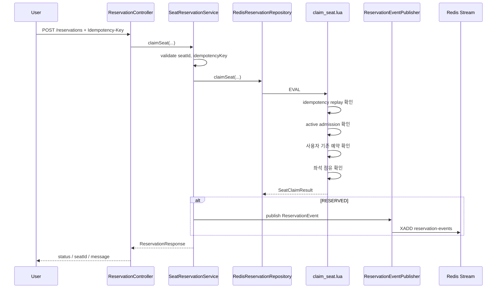
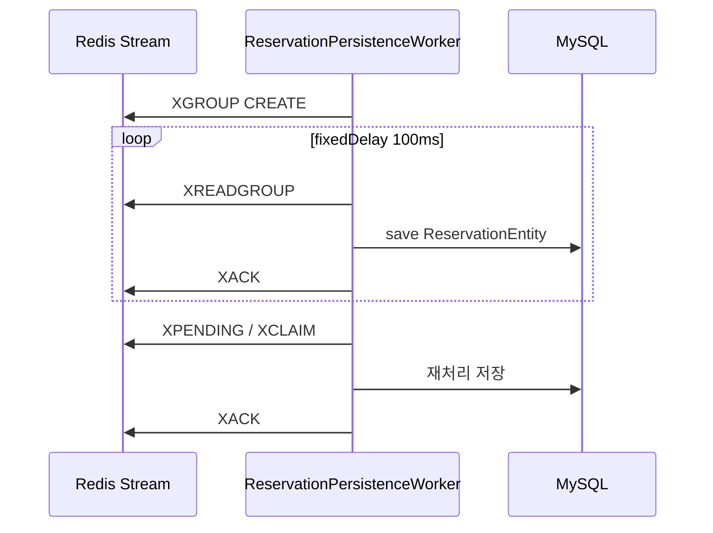

# Ticketing Traffic Lab: 대량 예매 트래픽을 대기열로 제어하는 토이 프로젝트

## 1. 개요

이 프로젝트는 명절 기차표 예매처럼 특정 시각에 사용자가 한꺼번에 몰리는 상황을 가정하고, 대량 트래픽을 바로 예매 트랜잭션으로 보내지 않기 위해 만든 학습용 시스템이다.

목표는 “상용 예매 서비스를 완성한다”가 아니라, 다음 질문을 직접 구현하고 테스트하는 것이었다.

> 30,000명의 사용자가 동시에 들어오면, 모든 요청을 DB로 보내지 않고 시스템이 감당 가능한 만큼만 흘려보낼 수 있을까?

이를 위해 전체 흐름을 다음처럼 나눴다.

```text
대량 진입 요청
-> Redis 대기열 등록
-> Scheduler가 초당 N명만 active 상태로 전환
-> active 사용자만 좌석 선점 가능
-> 좌석 선점은 Redis Lua Script로 원자 처리
-> 성공 이벤트만 Redis Stream을 통해 MySQL에 비동기 저장
```

주요 기술 스택은 Java 21, Spring Boot 3, Redis, MySQL, Docker Compose, Testcontainers, k6다.

패키지 구조는 **Feature-based Layered Architecture**로 잡았다. 기능 단위로 `queue`, `reservation`을 먼저 나누고, 각 기능 내부를 `api`, `application`, `domain`, `infrastructure`, `persistence` 계층으로 나눴다.

```text
com.example.ticketing
├── queue
│   ├── api
│   ├── application
│   ├── domain
│   └── infrastructure
├── reservation
│   ├── api
│   ├── application
│   ├── domain
│   ├── infrastructure
│   └── persistence
└── common
    ├── config
    └── error
```

엄밀한 Hexagonal Architecture는 아니다. `application` 계층이 port interface가 아니라 Redis repository 구현체를 직접 의존한다. 대신 토이 프로젝트 규모에서는 구조적 단순성과 기능 단위 가독성을 우선했다.

## 2. 비즈니스 요구사항

요구사항은 SpecKit을 사용해 기능 단위로 나눴다.

### 001. Queue Admission

사용자는 예매 API로 바로 가지 않고 먼저 대기열에 진입한다.

핵심 요구사항:

- event id와 user id로 대기열 진입 요청을 받을 수 있어야 한다.
- 수락된 요청에는 queue token을 발급해야 한다.
- 동일 event/user 조합은 중복 대기 순번을 만들면 안 된다.
- queue token으로 `WAITING`, `ENTERED`, `EXPIRED` 상태를 조회할 수 있어야 한다.
- scheduler는 오래 기다린 사용자부터 초당 설정된 수만큼 active 상태로 전환해야 한다.
- active admission은 기본 60초 TTL을 가져야 한다.
- 대기열 등록과 상태 조회는 MySQL을 사용하지 않아야 한다.

### 002. Seat Reservation

active admission을 받은 사용자만 좌석을 선점할 수 있다.

핵심 요구사항:

- active admission이 없는 사용자는 좌석 선점에 실패해야 한다.
- 같은 event/seat 조합은 최대 한 명만 `RESERVED`가 될 수 있어야 한다.
- 같은 event/user 조합은 최대 한 좌석만 예약할 수 있어야 한다.
- 좌석 선점 판단과 기록은 원자적으로 처리되어야 한다.
- 좌석 예매 hot path에서는 MySQL을 직접 사용하지 않아야 한다.

### 003. Idempotency

좌석 예매 요청은 `Idempotency-Key`를 요구한다.

핵심 요구사항:

- 같은 event/user/key 조합의 반복 요청은 최초 결과를 그대로 반환해야 한다.
- 같은 key로 재시도할 때 좌석 선점을 다시 시도하면 안 된다.
- 서로 다른 key는 별도 요청으로 취급한다.
- 단, 서로 다른 key라도 같은 event/user는 둘 이상의 좌석을 예약할 수 없다.
- `NOT_ACTIVE`, `SEAT_ALREADY_TAKEN` 같은 실패 결과도 같은 key 재시도에서는 동일하게 반환해야 한다.

### 004. Async Persistence

좌석 선점 성공 결과는 비동기로 MySQL에 저장한다.

핵심 요구사항:

- 좌석 선점 성공 시 예매 성공 이벤트를 영속화 대기열에 등록해야 한다.
- 예매 API는 DB 저장 완료를 기다리지 않고 응답해야 한다.
- worker는 이벤트를 소비해 MySQL에 저장해야 한다.
- 중복 이벤트가 들어와도 DB에 중복 저장되면 안 된다.
- worker 재시작 후 처리되지 않은 이벤트를 이어서 소비할 수 있어야 한다.

### 005. Load Test

대기열 API가 실제로 어느 정도의 진입 부하를 받을 수 있는지 k6로 검증한다.

핵심 요구사항:

- 30,000 VU 또는 30,000/s 같은 고부하 시나리오를 실행하고 결과를 문서화한다.
- 좌석 예매와 MySQL 부하는 queue-only 테스트에 포함하지 않는다.
- 실패하더라도 실패 원인과 병목 후보를 기록한다.
- 로컬 테스트 결과를 운영 환경 성능으로 과장하지 않는다.

## 3. 비기능적 요구사항

이 프로젝트에서 중요하게 본 비기능 요구사항은 다음이다.

### 정합성

- 좌석 수보다 많은 예매가 성공하면 안 된다.
- 같은 좌석은 한 명만 선점해야 한다.
- 같은 사용자는 한 이벤트에서 한 좌석만 예약해야 한다.
- 중복 요청은 최초 결과를 재사용해야 한다.

### 트래픽 제어

- 진입 요청을 바로 reservation 계층으로 보내지 않는다.
- scheduler가 초당 설정된 수만 active 상태로 전환한다.
- active TTL을 두어 입장 후 아무 행동도 하지 않는 사용자가 권한을 영구 점유하지 않게 한다.

### 응답 경로 최소화

- queue entry hot path에서는 순번 계산을 제거했다.
- 좌석 선점 hot path에서는 MySQL을 호출하지 않는다.
- 성공한 예매만 이벤트로 발행하고, DB 저장은 worker가 처리한다.

### 원자성

- Redis Lua Script로 여러 Redis 명령을 하나의 원자 작업으로 묶었다.
- queue entry 중복 진입, 좌석 선점, idempotency 결과 저장을 script 내부에서 처리한다.

### 관측 가능성

- 요청마다 `INFO` 로그를 남기지 않았다.
- 1초 10,000 요청 조건에서 request log는 관측성이 아니라 병목이 될 수 있기 때문이다.
- 대신 k6 summary JSON, Redis cardinality, 테스트 결과 문서, 블로그 초안을 남겼다.

## 4. SpecKit 사용 방법

이 프로젝트는 SpecKit 기반으로 기능을 나누고 구현했다.

사용 흐름은 대략 다음 순서였다.

```text
1. $speckit-specify
   - 자연어로 기능 요구사항 작성

2. $speckit-plan
   - 기술 선택, 데이터 모델, API 계약, 구현 전략 정리

3. $speckit-tasks
   - 구현 가능한 작업 단위로 분해

4. $speckit-analyze
   - spec, plan, tasks 사이의 불일치와 누락 확인

5. $speckit-implement
   - task 범위별 구현

6. $speckit-git-commit
   - 기능 단위 커밋
```

실제 기능은 다음처럼 분리했다.

```text
001-queue-admission
002-seat-reservation
003-idempotency
004-async-persistence
005-load-test
```

SpecKit을 사용한 장점은 “기능이 커지기 전에 요구사항, 데이터 모델, 테스트 기준을 먼저 고정한다”는 점이었다. 예를 들어 idempotency 기능은 단순히 “중복 요청 막기”가 아니라 다음처럼 명확히 정리됐다.

```text
같은 event/user/key 반복 요청은 최초 결과 반환
서로 다른 key는 별도 요청
하지만 같은 event/user는 둘 이상의 좌석을 가질 수 없음
NOT_ACTIVE 같은 실패 결과도 같은 key에서는 재사용
```

이렇게 정리해두니 Redis Lua Script에 어떤 상태를 저장해야 하는지, 테스트에서 무엇을 봐야 하는지가 선명해졌다.

## 5. 전체 아키텍처

전체 구조는 세 개의 큰 계층으로 나눌 수 있다.

```text
Traffic Shaping Layer
  - Queue API
  - Admission Scheduler
  - Redis waiting queue / active admission

Reservation Layer
  - Reservation API
  - ActiveAdmissionGuard
  - Redis Lua Script seat claim
  - Idempotency result

Persistence Layer
  - Redis Stream reservation-events
  - Persistence Worker
  - MySQL reservations
```

이 구조의 핵심은 DB를 보호하는 것이다. 사용자가 몰리는 첫 번째 지점은 MySQL이 아니라 Redis 대기열이다. MySQL은 최종 영속화 저장소로만 사용한다.

## 6. 아키텍처 설명

아래 그림은 이 프로젝트의 **목표 논리 아키텍처**다. 실제 로컬 부하 테스트는 단일 Spring Boot WAS로 실행했지만, 구조적으로는 API 서버를 여러 대로 늘리고 앞단에 Load Balancer를 둘 수 있도록 Redis를 공통 상태 저장소로 사용한다.

즉 현재 구현과 목표 배포 구조를 구분하면 다음과 같다.

```text
현재 로컬 테스트:
User/k6 -> Spring Boot 단일 WAS -> Redis/MySQL

목표 확장 구조:
User -> Load Balancer -> 다중 WAS -> Redis/MySQL
```

Load Balancer가 필요한 이유는 WAS가 여러 대일 때 사용자의 진입 요청, polling 요청, 예매 요청을 여러 API 서버로 분산하기 위해서다. 이때 queue token, active admission, 좌석 선점 상태는 WAS 메모리가 아니라 Redis에 있으므로, 어떤 WAS가 요청을 받아도 동일한 상태를 조회할 수 있다.



흐름을 사용자 관점에서 다시 요약하면 다음과 같다.

| 단계 | 사용자 행동 | 시스템 처리 | 사용자 응답 |
|------|-------------|-------------|-------------|
| 1 | 대기열 진입 | Redis에 token과 waiting ZSET 등록 | `queueToken`, `WAITING`, `pollAfterSeconds` |
| 2 | 대기 상태 polling | token으로 waiting rank 또는 active TTL 조회 | `WAITING + rank` 또는 `ENTERED + activeExpiresInSeconds` |
| 3 | 좌석 예매 요청 | active admission, idempotency, 좌석 점유 여부를 Lua로 원자 확인 | `RESERVED`, `NOT_ACTIVE`, `SEAT_ALREADY_TAKEN`, `ALREADY_RESERVED` |
| 4 | 예매 성공 후 | Redis Stream에 성공 이벤트 발행, worker가 MySQL 저장 | 사용자는 DB 저장 완료를 기다리지 않음 |

### 왜 Redis Sorted Set인가?

대기열은 “먼저 들어온 사용자를 먼저 입장”시켜야 한다. Redis Sorted Set은 score 기준 정렬과 rank 조회가 가능하다.

```text
waiting:{eventId}
member: userId
score: request timestamp + sequence
```

이를 통해 다음이 가능해진다.

- 오래 기다린 사용자부터 입장
- 현재 대기 순번 조회
- event별 대기열 분리
- MySQL 없이 queue 상태 처리

### 왜 Redis Lua Script인가?

좌석 선점과 idempotency는 여러 조건을 한 번에 확인해야 한다.

```text
active admission이 있는가?
같은 key로 이미 처리된 결과가 있는가?
같은 사용자가 이미 예약했는가?
좌석이 이미 점유됐는가?
```

이걸 애플리케이션에서 Redis 명령 여러 개로 나눠 처리하면 race condition이 생길 수 있다. 그래서 `claim_seat.lua` 안에서 한 번에 처리했다.

```lua
local stored = replay()
if stored then
  return stored
end

if redis.call('EXISTS', activeKey) == 0 then
  return store('NOT_ACTIVE', '', 'Active admission is required')
end

local existingSeat = redis.call('HGET', reservationUserKey, 'seatId')
if existingSeat then
  if existingSeat == seatId then
    return store('RESERVED', existingSeat, 'Already reserved by same user')
  end
  return store('ALREADY_RESERVED', existingSeat, 'User already reserved another seat')
end

local currentOwner = redis.call('GET', seatKey)
if currentOwner then
  return store('SEAT_ALREADY_TAKEN', seatId, 'Seat already taken')
end
```

### 왜 Kafka가 아니라 Redis Stream인가?

처음부터 Kafka를 도입하지 않았다. 이유는 명확하다.

이 프로젝트의 핵심은 메시징 플랫폼 운영이 아니라, 대량 진입 트래픽을 queue admission으로 제어하고 좌석 선점 정합성을 검증하는 것이다. Kafka를 쓰면 브로커 운영, topic/partition 설계, consumer group 운영, local dev 환경 복잡도가 커진다.

반면 이 프로젝트는 이미 Redis를 사용하고 있다.

```text
Queue: Redis Sorted Set
Active admission: Redis TTL key
Seat claim: Redis Lua Script
Idempotency: Redis Hash
```

따라서 예매 성공 이벤트의 비동기 저장도 Redis Stream으로 시작하는 것이 자연스럽다.

Redis Stream을 선택한 이유:

- 별도 브로커 없이 Redis 하나로 로컬 실험 가능
- consumer group 지원
- pending message 재처리 가능
- 예매 API가 MySQL 저장 완료를 기다리지 않아도 됨
- 토이 프로젝트 범위에서 충분한 내구성과 재처리 모델 제공

물론 운영 환경에서 이벤트량이 더 커지고, 여러 서비스가 이벤트를 공유해야 하며, 장기간 보관과 replay가 중요해진다면 Kafka가 더 적합할 수 있다. 하지만 이 프로젝트의 현재 범위에서는 Redis Stream이 복잡도 대비 효과가 좋았다.

### 왜 MySQL을 hot path에서 제외했는가?

좌석 선점 요청마다 MySQL transaction을 열면, 대량 트래픽이 들어올 때 DB connection pool과 row lock이 병목이 될 수 있다.

이 프로젝트에서는 다음처럼 분리했다.

```text
실시간 정합성: Redis Lua Script
최종 영속화: Redis Stream -> Worker -> MySQL
```

MySQL에는 최종 결과만 저장한다. 그리고 DB에는 unique constraint를 둬서 비동기 저장 중복을 한 번 더 방어한다.

```sql
UNIQUE KEY uk_reservation_event_user (event_id, user_id)
UNIQUE KEY uk_reservation_event_seat (event_id, seat_id)
```

## 7. 중요 데이터 시퀀스 플로우와 내부 구조

### 7.1 Queue Entry



처음에는 `POST /queue` 응답에서 rank와 total waiting을 바로 계산했다. 하지만 1초 10,000 요청 테스트에서 첫 응답 경로가 무거워졌다. 그래서 queue entry hot path를 줄였다.

현재 `POST /queue` 응답은 token 중심이다.

```json
{
  "queueToken": "...",
  "status": "WAITING",
  "rank": null,
  "totalWaiting": null,
  "pollAfterSeconds": 5
}
```

순번 계산은 상태 조회 API에서 한다.

```java
return queueRepository.getWaitingPosition(mapping.eventId(), mapping.userId())
        .map(this::waiting)
        .orElseGet(() -> activeOrExpired(mapping));
```

### 7.2 Admission Scheduler



이 구조 덕분에 reservation 계층은 모든 사용자를 받지 않는다. scheduler가 active로 전환한 사용자만 좌석 선점 API를 호출할 수 있다.

### 7.3 Seat Reservation



`SeatReservationService`는 application service다. controller와 Redis repository 사이에서 유스케이스를 조율한다.

```java
public ReservationResponse claimSeat(String eventId, String userId, String seatId, String idempotencyKey) {
    validateRequired("eventId", eventId);
    validateRequired("userId", userId);
    validateRequired("seatId", seatId);
    validateRequired("Idempotency-Key", idempotencyKey);

    if (!seatIdValidator.isValid(seatId)) {
        return new ReservationResponse(ReservationStatus.INVALID_SEAT, null, "Invalid seat id");
    }

    SeatClaimResult result = reservationRepository.claimSeat(...);
    if (result.status() == ReservationStatus.RESERVED) {
        eventPublisher.publish(new ReservationEvent(...));
    }
    return new ReservationResponse(result.status(), result.seatId(), result.message());
}
```

### 7.4 Async Persistence



worker는 Redis Stream consumer group을 사용한다. 처리 중 실패하거나 worker가 중단된 메시지는 pending 상태로 남고, 일정 idle 시간이 지나면 reclaim해서 다시 처리한다.

```java
@Scheduled(fixedDelay = 100)
public void scheduledProcess() {
    if (!properties.workerEnabled()) {
        return;
    }
    reclaimAndProcess(properties.pendingIdleMs());
    processOnce();
}
```

## 8. 테스트 결과

### 기능/정합성 테스트

JUnit, Spring Boot Test, Testcontainers를 사용했다.

검증한 주요 내용:

- queue token 발급
- 동일 event/user 중복 진입 시 같은 token 반환
- 동일 event/user 동시 100개 요청 시 token 1개와 waiting member 1개로 수렴
- scheduler가 admission rate만큼 active 전환
- active admission 없는 예매 요청 차단
- 같은 좌석 동시 요청에서 RESERVED 최대 1건
- 같은 user의 중복 좌석 예약 방지
- Idempotency-Key 반복 요청의 최초 결과 재사용
- Redis Stream 이벤트 발행과 MySQL 비동기 저장
- worker pending message 재처리

전체 테스트는 다음 명령으로 실행했다.

```bash
./gradlew test
```

### k6 부하 테스트

부하 테스트는 여러 번 나눠서 진행했다.

#### 1차: 30,000명 full flow queue-only

초기에는 30,000 VU가 `POST /queue` 이후 `GET /queue/{token}` polling까지 수행하도록 했다.

결과:

```text
iterations: 30,000
http_req_failed: 48.90%
http_req_duration p95: 10.46s
queue entries: 8,192
대표 에러: connection reset, timeout, can't assign requested address
```

해석:

단일 로컬 머신에서 30,000 VU가 동시에 localhost 연결을 만들 때, Redis queue 로직 이전에 OS socket, Tomcat accept, k6 local executor 한계가 먼저 드러났다.

#### 2차: 10,000명 full flow queue-only

단순히 수를 10,000명으로 낮췄다.

결과:

```text
iterations: 10,000
http_req_failed: 80.39%
http_req_duration p95: 665.47ms
queue entries: 808
대표 에러: connection reset by peer
```

해석:

latency는 줄었지만 실패율은 높았다. 전체 실행 시간이 짧아졌고, 초반 connection reset이 대부분을 차지했다. 문제는 “숫자”만이 아니라 “동시에 한 번에 연결을 여는 방식”이었다.

#### 3차: 1초 10,000건 entry-only

polling을 제거하고 `POST /queue`만 1초 동안 10,000건 보내도록 했다.

초기 결과:

```text
http_req_failed: 23.81%
http_req_duration p95: 1.18s
queue entries: 7,628
```

이후 개선:

- `POST /queue`에서 rank/totalWaiting 계산 제거
- queue entry Redis 등록을 Lua script로 원자화
- Tomcat thread, max connection, accept count 설정 명시

최종 결과:

```text
RATE=10000
DURATION=1s
http_req_failed: 0.00%
http_req_duration p95: 825.15ms
queue entries: 10,068
```

이 결과는 이 프로젝트에서 가장 중요한 성과다. 단일 로컬 머신 기준으로 1초 10,000건 queue entry 요청을 안정적으로 받았다.

#### 4차: 1초 30,000건 entry-only

같은 구조에서 rate만 30,000/s로 올렸다.

결과:

```text
RATE=30000
DURATION=1s
http_req_failed: 72.61%
http_req_duration p95: 10.62s
queue entries: 6,192
대표 에러: can't assign requested address, EOF
```

해석:

30,000/s 실패는 애플리케이션 코드만의 실패로 보기 어렵다. 대표 에러가 `can't assign requested address`였기 때문에, k6가 로컬에서 너무 많은 outbound TCP connection을 만들다가 OS socket/ephemeral port 한계에 닿은 것으로 해석했다.

정직한 결론은 다음이다.

```text
단일 로컬 머신 기준:
- 1초 10,000건 queue entry 요청은 통과
- 1초 30,000건 queue entry 요청은 로컬 부하 발생기/OS/socket 한계에 걸림
```

30,000/s를 계속 검증하려면 부하 발생기를 별도 머신으로 분리하거나, ramping 방식으로 유입을 나누고, OS TCP 설정과 Redis 배치까지 함께 조정해야 한다.

## 9. 프로젝트를 통해 배운 점

### 성능 병목은 한 곳에만 있지 않았다

처음에는 Redis queue 로직만 보면 될 것 같았다. 하지만 실제 부하 테스트에서는 Tomcat accept queue, worker thread, k6 local executor, OS ephemeral port, Redis round-trip이 모두 영향을 줬다.

그래서 단순히 “Redis를 쓰면 빠르다”가 아니라, 다음을 같이 봐야 했다.

```text
API hot path
WAS connection/thread/backlog 설정
Redis command/script 설계
부하 발생기의 위치와 한계
OS socket 자원
```

### 로그도 부하가 된다

요청마다 로그를 찍으면 관측성이 좋아질 것 같지만, 1초 10,000 요청에서는 로그 I/O 자체가 병목이 될 수 있다.

그래서 request-level 로그 대신 다음을 남겼다.

- k6 summary JSON
- Redis 상태 점검 결과
- 테스트 결과 문서
- 블로그 초안
- 정합성 테스트

### 실패 결과도 문서화해야 한다

30,000/s는 실패했다. 하지만 이 실패는 의미가 있었다. 로컬 단일 머신의 한계를 확인했고, 다음 단계가 무엇인지 알 수 있었다.

성공한 결과만 남기면 프로젝트가 좋아 보일 수는 있지만, 왜 실패했는지 설명할 수 없으면 시스템을 이해했다고 보기 어렵다.

## 10. 마무리

이 프로젝트는 대규모 트래픽을 완벽하게 처리하는 상용 시스템은 아니다. 대신 다음을 직접 설계하고 검증한 토이 프로젝트다.

- Redis Sorted Set 기반 대기열
- admission rate 기반 active token 전환
- Redis Lua 기반 좌석 선점 원자성
- Idempotency-Key 기반 중복 요청 처리
- Redis Stream 기반 비동기 MySQL 저장
- k6 기반 queue entry 부하 테스트
- 실패 결과까지 포함한 실험 문서화

가장 의미 있었던 결과는 이것이다.

```text
1초 10,000건 queue entry 요청 통과
http_req_failed: 0.00%
p95 latency: 825.15ms
queue entries: 10,068
```

그리고 가장 중요한 한계도 확인했다.

```text
1초 30,000건은 단일 로컬 머신에서 실패
주요 원인 후보: k6/OS socket 자원, ephemeral port, 로컬 Redis/Docker/WAS 동시 실행 한계
```

즉 이 프로젝트는 “성공 숫자”만을 위한 프로젝트가 아니라, 트래픽 제어 시스템을 만들며 병목을 분해하고 설명하는 연습이었다.

관련 문서:

- [README.md](README.md)
- [전체 아키텍처](docs/architecture.md)
- [Queue 컴포넌트](docs/components/queue.md)
- [Reservation 컴포넌트](docs/components/reservation.md)
- [1초 10,000건 Queue Entry 부하 테스트 결과](docs/load-test-results/005-fast-queue-entry-10000-1s.md)
- [1초 30,000건 Queue Entry 부하 테스트 한계 결과](docs/load-test-results/005-fast-queue-entry-30000-1s.md)
